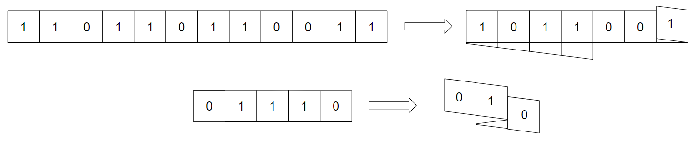

<h1 style='text-align: center;'> C. Folding Strip</h1>

<h5 style='text-align: center;'>time limit per test: 2 seconds</h5>
<h5 style='text-align: center;'>memory limit per test: 256 megabytes</h5>

You have a strip of paper with a binary string $s$ of length $n$. You can fold the paper in between any pair of adjacent digits.

A set of folds is considered valid if after the folds, all characters that are on top of or below each other match. ## Note

 that all folds are made at the same time, so the characters don't have to match in between folds.

For example, these are valid foldings of $s = \mathtt{110110110011}$ and $s = \mathtt{01110}$:

  The length of the folded strip is the length seen from above after all folds are made. So for the two above examples, after the folds shown above, the lengths would be $7$ and $3$, respectively.

Notice that for the above folding of $s = \mathtt{01110}$, if we made either of the two folds on their own, that would not be a valid folding. However, because we don't check for validity until all folds are made, this folding is valid.

After performing a set of valid folds, what is the minimum length strip you can form?

## Input

The first line of the input contains a single integer $t$ ($1 \le t \le 10^4$) — the number of test cases. The description of the test cases follows.

The first line of each test case contains a single integer $n$ ($1 \le n \le 2\cdot 10^5$) — the size of the strip.

The second line of each test case contains a string $s$ of $n$ characters '0' and '1' — a description of the digits on the strip.

It is guaranteed that the sum of $n$ over all test cases does not exceed $2\cdot 10^5$.

## Output

For each test case, output a single integer — the minimum possible length of the strip after a valid folding.

## Example

## Input


```

66101101101211011011001150111041111201
```
## Output


```

3
1
3
3
1
2

```
## Note

For the first example case, one optimal folding is to fold the strip in the middle, which produces a strip of length 3.

The third and fourth example cases correspond to the images above. ## Note

 that the folding shown above for $s = \mathtt{110110110011}$ is not of minimal length.


#### tags 

#2300 #constructive_algorithms #greedy #strings 