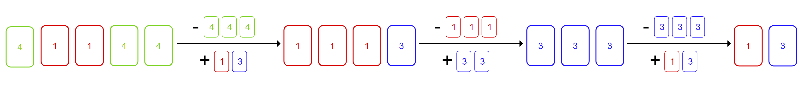

<h1 style='text-align: center;'> A. Card Exchange</h1>

<h5 style='text-align: center;'>time limit per test: 1 second</h5>
<h5 style='text-align: center;'>memory limit per test: 256 megabytes</h5>

You have a hand of $n$ cards, where each card has a number written on it, and a fixed integer $k$. You can perform the following operation any number of times:

* Choose any $k$ cards from your hand that all have the same number.
* Exchange these cards for $k-1$ cards, each of which can have any number you choose (including the number written on the cards you just exchanged).

Here is one possible sequence of operations for the first example case, which has $k=3$:

  What is the minimum number of cards you can have in your hand at the end of this process?

## Input

The first line of the input contains a single integer $t$ ($1 \le t \le 500$) — the number of test cases. The description of the test cases follows.

The first line of each test case contains two integers $n$ and $k$ ($1 \le n \le 100$, $2 \le k \le 100$) — the number of cards you have, and the number of cards you exchange during each operation, respectively.

The next line of each test case contains $n$ integers $c_1, c_2, \ldots c_n$ ($1 \le c_i \le 100$) — the numbers written on your cards.

## Output

For each test case, output a single integer — the minimum number of cards you can have left in your hand after any number of operations.

## Example

## Input


```

75 34 1 1 4 41 1077 24 2 1 100 5 2 310 41 1 1 1 1 1 1 1 1 15 23 8 1 48 76 210 20 30 10 20 406 310 20 30 10 20 40
```
## Output


```

2
1
1
3
5
1
6

```
## Note

The first example case corresponds to the picture above. The sequence of operations displayed there is optimal, so the answer is $2$.

In the second example case, no operations can be performed, so the answer is $1$.

In the fourth example case, you can repeatedly select $4$ cards numbered with $1$ and replace them with $3$ cards numbered with $1$, until there are $3$ cards left.


#### tags 

#800 #constructive_algorithms #games #greedy 