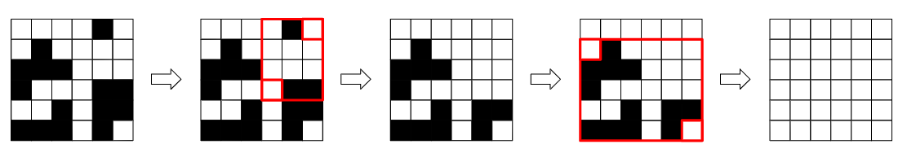

<h1 style='text-align: center;'> B. Rectangle Filling</h1>

<h5 style='text-align: center;'>time limit per test: 1 second</h5>
<h5 style='text-align: center;'>memory limit per test: 256 megabytes</h5>

There is an $n \times m$ grid of white and black squares. In one operation, you can select any two squares of the same color, and color all squares in the subrectangle between them that color.

Formally, if you select positions $(x_1, y_1)$ and $(x_2, y_2)$, both of which are currently the same color $c$, set the color of all $(x, y)$ where $\min(x_1, x_2) \le x \le \max(x_1, x_2)$ and $\min(y_1, y_2) \le y \le \max(y_1, y_2)$ to $c$.

This diagram shows a sequence of two possible operations on a grid:

  Is it possible for all squares in the grid to be the same color, after performing any number of operations (possibly zero)?

## Input

The first line of the input contains a single integer $t$ ($1 \le t \le 10^4$) — the number of test cases. The description of the test cases follows.

The first line of each test case contains two integers $n$ and $m$ ($1 \le n, m \le 500$) — the number of rows and columns in the grid, respectively.

Each of the next $n$ lines contains $m$ characters 'W' and 'B' — the initial colors of the squares of the grid. 

It is guaranteed that the sum of $n\cdot m$ over all test cases does not exceed $3\cdot 10^5$.

## Output

For each test case, print "YES" if it is possible to make all squares in the grid the same color, and "NO" otherwise.

You can output the answer in any case (upper or lower). For example, the strings "yEs", "yes", "Yes", and "YES" will be recognized as positive responses.

## Example

## Input


```

82 1WB6 6WWWWBWWBWWWWBBBWWWBWWWBBWWBWBBBBBWBW1 1W2 2BBBB3 4BWBWWBWBBWBW4 2BBBBWWWW4 4WWBWBBWBWWBBBBBB1 5WBBWB
```
## Output


```

NO
YES
YES
YES
YES
NO
YES
NO

```
## Note

In the first example, it is impossible to ever change the color of any square with an operation, so we output NO.

The second example is the case pictured above. As shown in that diagram, it is possible for all squares to be white after two operations, so we output YES.

In the third and fourth examples, all squares are already the same color, so we output YES.

In the fifth example we can do everything in two operations. First, select positions $(2, 1)$ and $(1, 4)$ and color all squares with $1 \le x \le 2$ and $1 \le y \le 4$ to white. Then, select positions $(2, 1)$ and $(3, 4)$ and color all squares with $2 \le x \le 3$ and $1 \le y \le 4$ to white. After these two operations all squares are white.


#### tags 

#1100 #constructive_algorithms #implementation 