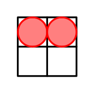
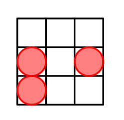
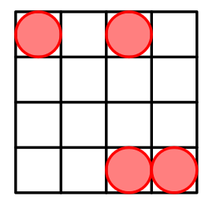
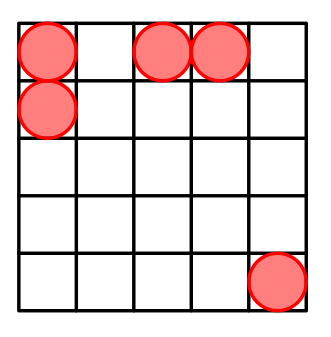
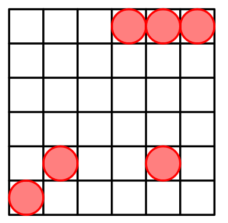

<h1 style='text-align: center;'> E. Cells Arrangement</h1>

<h5 style='text-align: center;'>time limit per test: 2 seconds</h5>
<h5 style='text-align: center;'>memory limit per test: 256 megabytes</h5>

You are given an integer $n$. You choose $n$ cells $(x_1,y_1), (x_2,y_2),\dots,(x_n,y_n)$ in the grid $n\times n$ where $1\le x_i\le n$ and $1\le y_i\le n$.

Let $\mathcal{H}$ be the set of distinct Manhattan distances between any pair of cells. Your task is to maximize the size of $\mathcal{H}$. ## Example

s of sets and their construction are given in the notes.

If there exists more than one solution, you are allowed to output any.

Manhattan distance between cells $(x_1,y_1)$ and $(x_2,y_2)$ equals $|x_1-x_2|+|y_1-y_2|$.

## Input

The first line contains a single integer $t$ ($1\le t\le 50$) — the number of test cases.

Each of the following $t$ lines contains a single integer $n$ ($2\le n\le 10^3$).

## Output

For each test case, output $n$ points which maximize the size of $\mathcal{H}$. It is not necessary to output an empty line at the end of the answer for each test case.

## Example

## Input


```

523456
```
## Output


```

1 1
1 2

2 1
2 3
3 1

1 1
1 3
4 3
4 4

1 1
1 3
1 4
2 1
5 5

1 4
1 5
1 6
5 2
5 5
6 1

```
## Note

In the first testcase we have $n=2$. One of the possible arrangements is: 

  The arrangement with cells located in $(1,1)$ and $(1,2)$.  In this case $\mathcal{H}=\{|1-1|+|1-1|,|1-1|+|2-2|,|1-1|+|1-2|\}=\{0,0,1\}=\{0,1\}$. Hence, the size of $\mathcal{H}$ is $2$. It can be shown that it is the greatest possible answer.In the second testcase we have $n=3$. The optimal arrangement is: 

  The arrangement with cells located in $(2,1)$, $(2,3)$ and $(3,1)$. $\mathcal{H}$=$\{|2-2|+|1-1|,|2-2|+|3-3|,|3-3|+|1-1|,|2-2|+|1-3|,|2-3|+|1-1|,|2-3|+|3-1|\}$=$\{0,0,0,2,1,3\}$=$\{0,1,2,3\}$.

For $n=4$ a possible arrangement is: 

  For $n=5$ a possible arrangement is: 

  For $n=6$ a possible arrangement is: 

  

#### tags 

#1600 #constructive_algorithms 