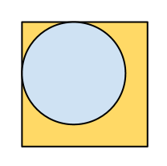
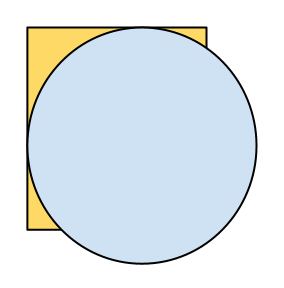

<h1 style='text-align: center;'> A. Plate Game</h1>

<h5 style='text-align: center;'>time limit per test: 2 seconds</h5>
<h5 style='text-align: center;'>memory limit per test: 256 megabytes</h5>

You've got a rectangular table with length *a* and width *b* and the infinite number of plates of radius *r*. Two players play the following game: they take turns to put the plates on the table so that the plates don't lie on each other (but they can touch each other), and so that any point on any plate is located within the table's border. During the game one cannot move the plates that already lie on the table. The player who cannot make another move loses. Determine which player wins, the one who moves first or the one who moves second, provided that both players play optimally well.

## Input

A single line contains three space-separated integers *a*, *b*, *r* (1 ≤ *a*, *b*, *r* ≤ 100) — the table sides and the plates' radius, correspondingly.

## Output

If wins the player who moves first, print "First" (without the quotes). Otherwise print "Second" (without the quotes).

## Examples

## Input


```
5 5 2  

```
## Output


```
First  

```
## Input


```
6 7 4  

```
## Output


```
Second  

```
## Note

In the first sample the table has place for only one plate. The first player puts a plate on the table, the second player can't do that and loses.

  In the second sample the table is so small that it doesn't have enough place even for one plate. So the first player loses without making a single move.

  

#### tags 

#1600 #constructive_algorithms #games #math 