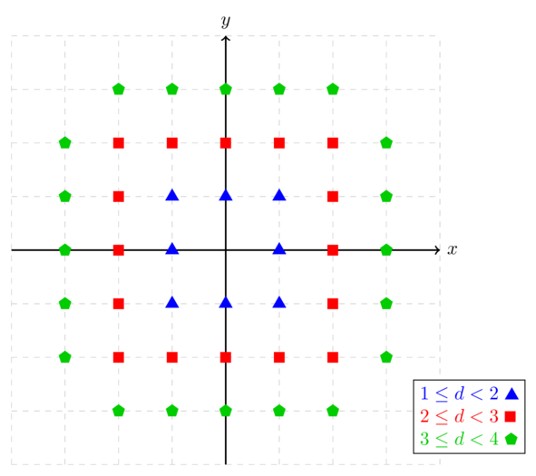

<h1 style='text-align: center;'> F. Circle Perimeter</h1>

<h5 style='text-align: center;'>time limit per test: 1 second</h5>
<h5 style='text-align: center;'>memory limit per test: 256 megabytes</h5>

Given an integer $r$, find the number of lattice points that have a Euclidean distance from $(0, 0)$ greater than or equal to $r$ but strictly less than $r+1$.

A lattice point is a point with integer coordinates. The Euclidean distance from $(0, 0)$ to the point $(x,y)$ is $\sqrt{x^2 + y^2}$.

## Input

The first line contains a single integer $t$ ($1 \leq t \leq 1000$) — the number of test cases.

The only line of each test case contains a single integer $r$ ($1 \leq r \leq 10^5$).

The sum of $r$ over all test cases does not exceed $10^5$.

## Output

For each test case, output a single integer — the number of lattice points that have an Euclidean distance $d$ from $(0, 0)$ such that $r \leq d < r+1$.

## Example

## Input


```

6123451984
```
## Output


```

8
16
20
24
40
12504

```
## Note

The points for the first three test cases are shown below. 

  

#### tags 

#1600 #binary_search #brute_force #dfs_and_similar #geometry #implementation #math 