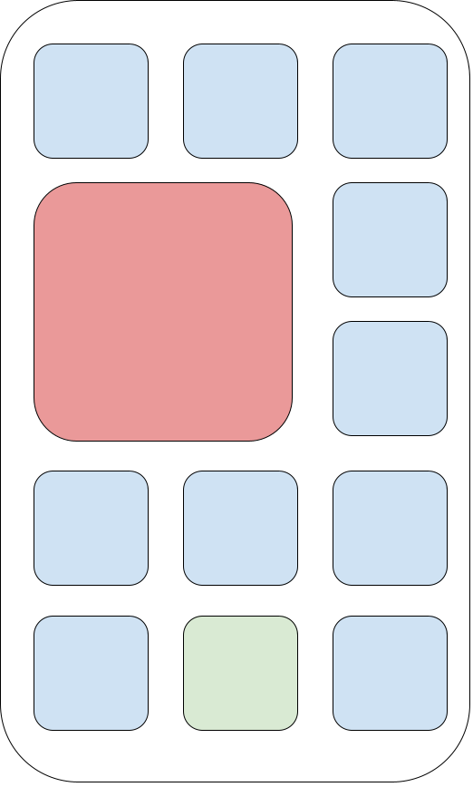
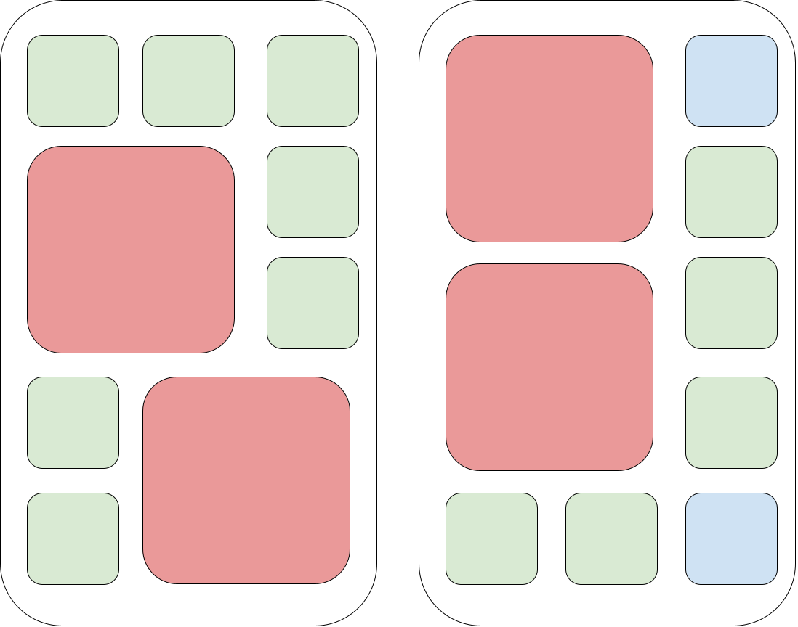

<h1 style='text-align: center;'> A. Phone Desktop</h1>

<h5 style='text-align: center;'>time limit per test: 1 second</h5>
<h5 style='text-align: center;'>memory limit per test: 256 megabytes</h5>

Little Rosie has a phone with a desktop (or launcher, as it is also called). The desktop can consist of several screens. Each screen is represented as a grid of size $5 \times 3$, i.e., five rows and three columns.

There are $x$ applications with an icon size of $1 \times 1$ cells; such an icon occupies only one cell of the screen. There are also $y$ applications with an icon size of $2 \times 2$ cells; such an icon occupies a square of $4$ cells on the screen. Each cell of each screen can be occupied by no more than one icon.

Rosie wants to place the application icons on the minimum number of screens. Help her find the minimum number of screens needed.

## Input

The first line of the input contains $t$ ($1 \leq t \leq 10^4$) — the number of test cases. 

The first and only line of each test case contains two integers $x$ and $y$ ($0 \leq x, y \leq 99$) — the number of applications with a $1 \times 1$ icon and the number of applications with a $2 \times 2$ icon, respectively.

## Output

For each test case, output the minimal number of required screens on a separate line.

## Example

## Input


```

111 17 212 40 31 08 10 02 015 08 20 9
```
## Output


```

1
1
2
2
1
1
0
1
1
2
5

```
## Note

The solution for the first test case can look as follows:

  Blue squares represent empty spaces for icons, green squares represent $1 \times 1$ icons, red squares represent $2 \times 2$ icons The solution for the third test case can look as follows:

  

#### tags 

#800 #greedy #math 