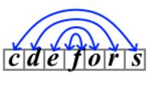

<h1 style='text-align: center;'> B. Symmetric Encoding</h1>

<h5 style='text-align: center;'>time limit per test: 2 seconds</h5>
<h5 style='text-align: center;'>memory limit per test: 256 megabytes</h5>

Polycarp has a string $s$, which consists of lowercase Latin letters. He encodes this string using the following algorithm:

* first, he constructs a new auxiliary string $r$, which consists of all distinct letters of the string $s$, written in alphabetical order;
* then the encoding happens as follows: each character in the string $s$ is replaced by its symmetric character from the string $r$ (the first character of the string $r$ will be replaced by the last, the second by the second from the end, and so on).

For example, encoding the string $s$="codeforces" happens as follows:

* the string $r$ is obtained as "cdefors";
* the first character $s_1$='c' is replaced by 's';
* the second character $s_2$='o' is replaced by 'e';
* the third character $s_3$='d' is replaced by 'r';
* ...
* the last character $s_{10}$='s' is replaced by 'c'.

  The string $r$ and replacements for $s$="codeforces". Thus, the result of encoding the string $s$="codeforces" is the string "serofedsoc".

Write a program that performs decoding — that is, restores the original string $s$ from the encoding result.

## Input

The first line contains a single integer $t$ ($1 \le t \le 10^4$) — the number of test cases.

The first line of each test case contains a single integer $n$ ($1 \le n \le 2 \cdot 10^5$) — the length of the string $b$.

The second line of each test case contains a string $b$ of length $n$, consisting of lowercase Latin letters — the result of encoding the original string $s$.

It is guaranteed that the sum of the values of $n$ over all test cases in the test does not exceed $2 \cdot 10^5$.

## Output

For each test case, output the string $s$ from which the encoding result $b$ was obtained.

## Example

## Input


```

510serofedsoc3ttf9tlrhgmaoi1w15hnndledmnhlttin
```
## Output


```

codeforces
fft
algorithm
w
meetinthemiddle

```


#### tags 

#800 #implementation #sortings #strings 