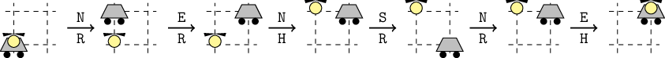

<h1 style='text-align: center;'> D. Ingenuity-2</h1>

<h5 style='text-align: center;'>time limit per test: 2 seconds</h5>
<h5 style='text-align: center;'>memory limit per test: 256 megabytes</h5>

Let's imagine the surface of Mars as an infinite coordinate plane. Initially, the rover Perseverance-2 and the helicopter Ingenuity-2 are located at the point with coordinates $(0, 0)$. A set of instructions $s$ consisting of $n$ instructions of the following types was specially developed for them:

* N: move one meter north (from point $(x, y)$ to $(x, y + 1)$);
* S: move one meter south (from point $(x, y)$ to $(x, y - 1)$);
* E: move one meter east (from point $(x, y)$ to $(x + 1, y)$);
* W: move one meter west (from point $(x, y)$ to $(x - 1, y)$).

Each instruction must be executed either by the rover or by the helicopter. Moreover, each device must execute at least one instruction. Your task is to distribute the instructions in such a way that after executing all $n$ instructions, the helicopter and the rover end up at the same point, or determine that this is impossible.

## Input

The first line of input contains $t$ ($1 \leq t \leq 10^4$) — the number of test cases.

The first line of each test case contains a single integer $n$ ($1 \le n \le 2 \cdot 10^5$) — the number of instructions.

The second line of each test case contains a string $s$ of length $n$ consisting of the characters 'N', 'S', 'E', 'W' — the sequence of instructions.

It is guaranteed that the sum of $n$ over all test cases does not exceed $2 \cdot 10 ^ 5$.

## Output

For each test case, if the required distribution of instructions exists, output a string $p$ of length $n$ consisting of the characters 'R', 'H'. If the $i$-th operation should be executed by the rover, then $p_i=\text{R}$, if the $i$-th operation should be executed by the helicopter, then $p_i=\text{H}$. If there are multiple solutions, output any of them.

Otherwise, output NO.

## Example

## Input


```

106NENSNE3WWW6NESSWS2SN2WE4SSNN4WESN2SS4EWNN4WEWE
```
## Output


```

RRHRRH
NO
HRRHRH
NO
NO
RHRH
RRHH
RH
RRRH
RRHH
```
## Note

Let's consider the first example: the string $S = \texttt{NENSNE}$. One of the possible solutions, shown in the figure below, is $p = \texttt{RRHRRH}$, using which both the rover and the helicopter will end up one meter north and one meter east.

  For WWW, the solution is impossible.


#### tags 

#1400 #constructive_algorithms #greedy #implementation 