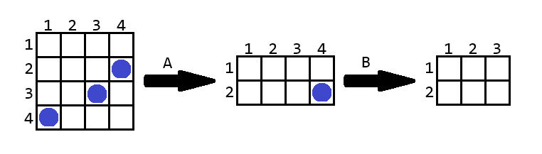

<h1 style='text-align: center;'> F. Cutting Game</h1>

<h5 style='text-align: center;'>time limit per test: 3 seconds</h5>
<h5 style='text-align: center;'>memory limit per test: 256 megabytes</h5>

Alice and Bob were playing a game again. They have a grid of size $a \times b$ ($1 \le a, b \le 10^9$), on which there are $n$ chips, with at most one chip in each cell. The cell at the intersection of the $x$-th row and the $y$-th column has coordinates $(x, y)$.

Alice made the first move, and the players took turns. On each move, a player could cut several (but not all) rows or columns from the beginning or end of the remaining grid and earn a point for each chip that was on the cut part of the grid. Each move can be described by the character 'U', 'D', 'L', or 'R' and an integer $k$:

* If the character is 'U', then the first $k$ remaining rows will be cut;
* If the character is 'D', then the last $k$ remaining rows will be cut;
* If the character is 'L', then the first $k$ remaining columns will be cut;
* If the character is 'R', then the last $k$ remaining columns will be cut.

Based on the initial state of the grid and the players' moves, determine the number of points earned by Alice and Bob, respectively.

## Input

The first line contains a single integer $t$ ($1 \le t \le 10^4$) — the number of test cases.

The first line of each test case contains four integers $a$, $b$, $n$, and $m$ ($2 \le a, b \le 10^9$, $1 \le n, m \le 2 \cdot 10^5$) — the dimensions of the grid, the number of chips, and the number of moves.

Each of the next $n$ lines contain two integers $x_i$ and $y_i$ ($1 \le x_i \le a$, $1 \le y_i \le b$) — the coordinates of the chips. All pairs of coordinates are distinct.

Each of the next $m$ lines contain a character $c_j$ and an integer $k_j$ — the description of the $j$-th move. It is guaranteed that $k$ is less than the number of rows/columns in the current grid. In other words, a player cannot cut the entire remaining grid on their move.

It is guaranteed that the sum of the values of $n$ across all test cases in the test does not exceed $2 \cdot 10^5$. It is guaranteed that the sum of the values of $m$ across all test cases in the test does not exceed $2 \cdot 10^5$.

## Output

For each test case, output two integers — the number of points earned by Alice and Bob, respectively.

## Example

## Input


```

64 4 3 24 13 32 4D 2R 14 4 3 34 13 22 3D 1L 1U 23 5 3 21 32 23 3R 2R 26 4 4 21 42 35 31 1R 1U 19 3 2 16 13 3D 810 10 2 57 59 1R 1L 2D 1U 4D 1
```
## Output


```

2 1
2 0
0 3
1 1
2 0
0 1

```
## Note

Below is the game from the first example:

  On her turn, Alice cut $2$ rows from the bottom and scored $2$ points, then Bob cut $1$ column from the right and scored one point. ## Note

 that if Bob had cut $1$ row from the bottom, he would have also scored $1$ point.


#### tags 

#1900 #binary_search #brute_force #data_structures #implementation #sortings #two_pointers 