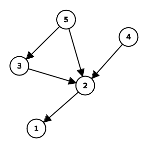

<h1 style='text-align: center;'> E. Tensor</h1>

<h5 style='text-align: center;'>time limit per test: 3 seconds</h5>
<h5 style='text-align: center;'>memory limit per test: 256 megabytes</h5>

This is an interactive problem.

You are given an integer $n$.

The jury has hidden from you a directed graph with $n$ vertices (numbered from $1$ to $n$) and some number of edges. You additionally know that: 

* The graph only contains edges of the form $i \leftarrow j$, where $1 \le i < j \le n$.
* For any three vertices $1 \le i < j < k \le n$, at least one of the following holds$^\dagger$:
	+ Vertex $i$ is reachable from vertex $j$, or
	+ Vertex $i$ is reachable from vertex $k$, or
	+ Vertex $j$ is reachable from vertex $k$.

You want to color each vertex in either black or white such that for any two vertices $i$ and $j$ ($1 \le i < j \le n$) of the same color, vertex $i$ is reachable from vertex $j$.

To do that, you can ask queries of the following type: 

* ? i j — is vertex $i$ reachable from vertex $j$ ($1 \le i < j \le n$)?

Find any valid vertex coloring of the hidden graph in at most $2 \cdot n$ queries. It can be proven that such a coloring always exists.

## Note

 that the grader is not adaptive: the graph is fixed before any queries are made.

$^\dagger$ Vertex $a$ is reachable from vertex $b$ if there exists a [path](https://en.wikipedia.org/wiki/Path_(graph_theory)) from vertex $b$ to vertex $a$ in the graph.

## Input

Each test contains multiple test cases. The first line of input contains a single integer $t$ ($1 \le t \le 1000$) — the number of test cases. The description of the test cases follows.

The only line of each test case contains a single integer $n$ ($3 \le n \le 100$) — the number of vertices in the hidden graph.

It is guaranteed that the sum of $n$ over all test cases does not exceed $1000$.

## Interaction

The interaction for each test case begins by reading the integer $n$.

To make a query, output "? i j" without quotes ($1 \le i < j \le n$). If vertex $i$ is reachable from vertex $j$, you will get YES as an answer. Otherwise, you will get NO as an answer.

If you receive the integer $-1$ instead of an answer or a valid value of $n$, it means your program has made an invalid query, has exceeded the limit of queries, or has given an incorrect answer on the previous test case. Your program must terminate immediately to receive a Wrong Answer verdict. Otherwise, you can get an arbitrary verdict because your solution will continue to read from a closed stream.

When you are ready to give the final answer, output "! $c_1 \ c_2 \ \ldots \ c_n$" without quotes — the colors of the vertices, where $c_i = 0$ if the vertex is black, and $c_i = 1$ if the vertex is white. After solving all test cases, your program should be terminated immediately.

After printing a query, do not forget to output an end of line and flush the output. Otherwise, you will get Idleness limit exceeded. To do this, use: 

* fflush(stdout) or cout.flush() in C++;
* System.out.flush() in Java;
* flush(output) in Pascal;
* stdout.flush() in Python;
* see documentation for other languages.

Hacks

To hack, use the following format:

The first line contains an integer $t$ ($1 \le t \le 1000$) — the number of test cases.

The first line of each test case contains two integers $n$ and $m$ ($3 \le n \le 100$, $0 \le m \le \frac{n\cdot(n - 1)}{2}$) — the number of vertices and edges in the graph.

Each of the following $m$ lines should contain two integers $a$ and $b$ ($1 \le b < a \le n$), indicating that there is the edge $a \rightarrow b$ in the graph. The graph should satisfy the conditions above.

The sum of $n$ over all test cases should not exceed $1000$.

## Example

## Input


```

2
4

YES

YES

YES

NO

NO

NO

5


```
Output
```

? 1 2

? 2 3

? 1 3

? 1 4

? 2 4

? 3 4

! 0 0 0 1

! 1 1 0 1 0

```
## Note

The hidden graph in the first test case: 

  The hidden graph in the second test case: 

  The interaction happens as follows:


| Solution | Jury | Explanation |
| --- | --- | --- |
|  | 2 | There are $2$ test cases. |
|  | 4 | In the first test case, the graph has $4$ vertices. |
| ? 1 2 | YES | The solution asks if vertex $1$ is reachable from vertex $2$, and the jury answers YES. |
| ? 2 3 | YES | The solution asks if vertex $2$ is reachable from vertex $3$, and the jury answers YES. |
| ? 1 3 | YES | The solution asks if vertex $1$ is reachable from vertex $3$, and the jury answers YES. |
| ? 1 4 | NO | The solution asks if vertex $1$ is reachable from vertex $4$, and the jury answers NO. |
| ? 2 4 | NO | The solution asks if vertex $2$ is reachable from vertex $4$, and the jury answers NO. |
| ? 3 4 | NO | The solution asks if vertex $3$ is reachable from vertex $4$, and the jury answers NO. |
| ! 0 0 0 1 |  | The solution has somehow determined a valid coloring and outputs it. Since the output is correct, the jury continues to the next test case. |
|  | 5 | In the second test case, the graph has $5$ vertices. |
| ! 1 1 0 1 0 |  | The solution has somehow determined a valid coloring, and outputs it. Since the output is correct and there are no more test cases, the jury and the solution exit. |


## Note

 that the line breaks in the example input and output are for the sake of clarity, and do not occur in the real interaction.


#### tags 

#2600 #constructive_algorithms #graphs #interactive 