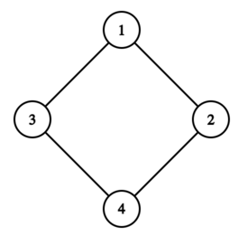
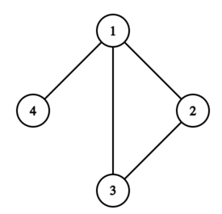

<h1 style='text-align: center;'> F. Kostyanych's Theorem</h1>

<h5 style='text-align: center;'>time limit per test: 3 seconds</h5>
<h5 style='text-align: center;'>memory limit per test: 256 megabytes</h5>

This is an interactive problem.

Kostyanych has chosen a complete undirected graph$^{\dagger}$ with $n$ vertices, and then removed exactly $(n - 2)$ edges from it. You can ask queries of the following type:

* "? $d$" — Kostyanych tells you the number of vertex $v$ with a degree at least $d$. Among all possible such vertices, he selects the vertex with the minimum degree, and if there are several such vertices, he selects the one with the minimum number. He also tells you the number of another vertex in the graph, with which $v$ is not connected by an edge (if none is found, then $0$ is reported). Among all possible such vertices, he selects the one with the minimum number. Then he removes the vertex $v$ and all edges coming out of it. If the required vertex $v$ is not found, then "$0\ 0$" is reported.

Find a Hamiltonian path$^{\ddagger}$ in the original graph in at most $n$ queries. It can be proven that under these constraints, a Hamiltonian path always exists.

$^{\dagger}$A complete undirected graph is a graph in which there is exactly one undirected edge between any pair of distinct vertices. Thus, a complete undirected graph with $n$ vertices contains $\frac{n(n-1)}{2}$ edges.

$^{\ddagger}$A Hamiltonian path in a graph is a path that passes through each vertex exactly once.

## Input

Each test consists of multiple test cases. The first line contains a single integer $t$ ($1 \le t \le 1000$) — the number of test cases. The description of the test cases follows.

The only line of each test case contains a single integer $n$ ($2 \le n \le 10^5$) — the number of vertices in the graph.

It is guaranteed that the sum of $n$ over all test cases does not exceed $10^5$.

## Interaction

## Interaction

 for each test case begins with reading the integer $n$.

Then you can make no more than $n$ queries.

To make a query, output a line in the format "? $d$" (without quotes) ($0 \le d \le n - 1$). After each query, read two integers — the answer to your query.

When you are ready to report the answer, output a line in the format "! $v_1\ v_2 \ldots v_n$" (without quotes) — the vertices in the order of their occurrence in the Hamiltonian path. Outputting the answer does not count as one of the $n$ queries. After solving one test case, the program should immediately move on to the next one. After solving all test cases, the program should be terminated immediately.

If your program makes more than $n$ queries for one test case or makes an incorrect query, then the response to the query will be $-1$, and after receiving such a response, your program should immediately terminate to receive the verdict Wrong answer. Otherwise, it may receive any other verdict.

After outputting a query, do not forget to output an end of line and flush the output buffer. Otherwise, you will receive the verdict Idleness limit exceeded. To do this, use:

* fflush(stdout) or cout.flush() in C++;
* System.out.flush() in Java;
* flush(output) in Pascal;
* stdout.flush() in Python;
* see documentation for other languages.

The interactor is non-adaptive. The graph does not change during the interaction.

Hacks

To hack, use the following format:

The first line contains a single integer $t$ ($1 \le t \le 1000$) — the number of test cases.

The only line of each test case contains a single integer $n$ ($2 \le n \le 10^5$) — the number of vertices in the graph.

Each of the following $(n - 2)$ lines should contains two integers $u$ and $v$ ($1 \le u, v \le n$, $u \ne v$) — ends of the edge that was removed from the graph. Each edge must not occur more than once.

The sum of $n$ over all test cases should not exceed $10^5$.

## Example

## Input


```

3
4

0 0

1 4

2 3

4

1 0

4 2

2

1 0


```
Output
```


? 3

? 2

? 1

! 4 3 1 2

? 3

? 0

! 4 1 2 3

? 0

! 2 1
```
## Note

In the first test case, the original graph looks as follows:

  Consider the queries:

* There are no vertices with a degree of at least $3$ in the graph, so "$0\ 0$" is reported.
* There are four vertices with a degree of at least $2$, and all of them have a degree of exactly $2$: $1$, $2$, $3$, $4$. Vertex $1$ is reported, because it has the minimum number, and vertex $4$ is reported, because it is the only one not connected to vertex $1$. After this, vertex $1$ is removed from the graph.
* There are three vertices with a degree of at least $1$, among them vertices $2$ and $3$ have a minimum degree of $1$ (vertex $4$ has a degree of $2$). Vertex $2$ is reported, because it has the minimum number, and vertex $3$ is reported, because it is the only one not connected to vertex $2$. After this, vertex $2$ is removed from the graph.

The path $4 - 3 - 1 - 2$ is a Hamiltonian path.

In the second test case, the original graph looks as follows:

  Consider the queries:

* Vertex $1$ has a degree of at least $3$, but it is connected to all vertices, so "$1\ 0$" is reported. After this, vertex $1$ is removed from the graph.
* The remaining vertices $2$, $3$, and $4$ have a degree of at least $0$, but among them vertex $4$ has the minimum degree of $0$ (vertices $2$ and $3$ have a degree of $1$). Vertex $4$ is not connected to both vertices $2$ and $3$, so vertex $2$ is reported (as it has the minimum number). After this, vertex $4$ is removed from the graph.

The path $4 - 1 - 2 - 3$ is a Hamiltonian path.

In the third test case, the graph consists of $2$ vertices connected by an edge.


#### tags 

#2900 #brute_force #constructive_algorithms #graphs #interactive 