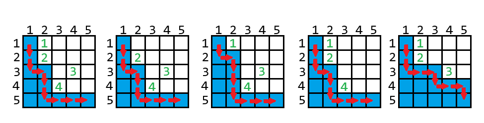

<h1 style='text-align: center;'> F2. Field Division (hard version)</h1>

<h5 style='text-align: center;'>time limit per test: 3 seconds</h5>
<h5 style='text-align: center;'>memory limit per test: 256 megabytes</h5>

This is a hard version of the problem; it differs from the easy version only by the question. The easy version only needs you to print whether some values are non-zero or not. The hard version needs you to print the exact values.

Alice and Bob are dividing the field. The field is a rectangle of size $n \times m$ ($2 \le n, m \le 10^9$); the rows are numbered from $1$ to $n$ from top to bottom, and the columns are numbered from $1$ to $m$ from left to right. The cell at the intersection of row $r$ and column $c$ is denoted as ($r, c$).

Bob has $k$ ($2 \le k \le 2 \cdot 10^5$) fountains, all of them are located in different cells of the field. Alice is responsible for dividing the field, but she must meet several conditions:

* To divide the field, Alice will start her path in any free (without a fountain) cell on the left or top side of the field and will move, each time moving to the adjacent cell down or right. Her path will end on the right or bottom side of the field.
* Alice's path will divide the field into two parts — one part will belong to Alice (this part includes the cells of her path), the other part — to Bob.
* Alice will own the part that includes the cell ($n, 1$).
* Bob will own the part that includes the cell ($1, m$).

Alice wants to divide the field in such a way as to get as many cells as possible.

Bob wants to keep ownership of all the fountains, but he can give one of them to Alice. First, output the integer $\alpha$ — the maximum possible size of Alice's plot, if Bob does not give her any fountain (i.e., all fountains will remain on Bob's plot).

Then output $k$ non-negative integers $a_1, a_2, \dots, a_k$, where $a_i$ is a value such that after Bob gives Alice the $i$-th fountain, the maximum size of her plot will be $\alpha + a_i$.

## Input

The first line contains a single integer $t$ ($1 \le t \le 10^4$) — the number of test cases.

The first line of each test case contains three integers $n$, $m$, and $k$ ($2 \le n, m \le 10^9$, $2 \le k \le 2 \cdot 10^5$) — the field sizes and the number of fountains, respectively.

Then follow $k$ lines, each containing two numbers $r_i$ and $c_i$ ($1 \le r_i \le n$, $1 \le c_i \le m$) — the coordinates of the cell with the $i$-th fountain. It is guaranteed that all cells are distinct and none of them is ($n, 1$).

It is guaranteed that the sum of $k$ over all test cases does not exceed $2 \cdot 10^5$.

## Output

For each test case, first output $\alpha$ — the maximum size of the plot that can belong to Alice if Bob does not give her any of the fountains. Then output $k$ non-negative integers $a_1, a_2, \dots, a_k$, where $a_i$ is a value such that after Bob gives Alice the $i$-th fountain, the maximum size of her plot will be $\alpha + a_i$.

## Example

## Input


```

52 2 31 11 22 25 5 41 22 23 44 32 5 91 21 51 12 22 42 51 42 31 36 4 46 21 31 41 23 4 52 13 21 41 32 4
```
## Output


```

1
1 0 1 
11
0 1 0 4 
1
0 0 1 1 0 0 0 0 0 
6
15 0 0 0 
1
2 3 0 0 0 

```
## Note

Below are the images for the second example: 

  The indices of the fountains are labeled in green. The cells belonging to Alice are marked in blue. ## Note

 that if Bob gives Alice fountain $1$ or fountain $3$, then that fountain cannot be on Alice's plot.


#### tags 

#2400 #math #sortings 