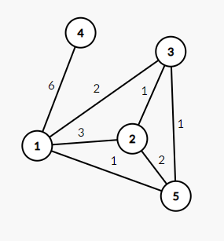
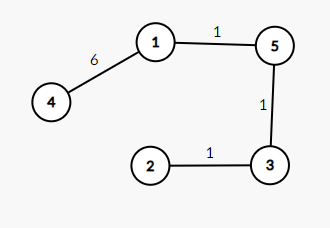
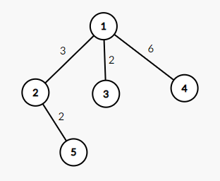
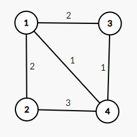
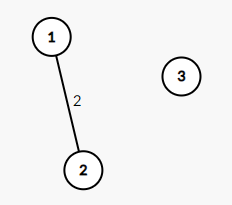

<h1 style='text-align: center;'> E. Turtle and Intersected Segments</h1>

<h5 style='text-align: center;'>time limit per test: 5 seconds</h5>
<h5 style='text-align: center;'>memory limit per test: 512 megabytes</h5>

Turtle just received $n$ segments and a sequence $a_1, a_2, \ldots, a_n$. The $i$-th segment is $[l_i, r_i]$.

Turtle will create an undirected graph $G$. If segment $i$ and segment $j$ intersect, then Turtle will add an undirected edge between $i$ and $j$ with a weight of $|a_i - a_j|$, for every $i \ne j$.

Turtle wants you to calculate the sum of the weights of the edges of the minimum spanning tree of the graph $G$, or report that the graph $G$ has no spanning tree.

We say two segments $[l_1, r_1]$ and $[l_2, r_2]$ intersect if and only if $\max(l_1, l_2) \le \min(r_1, r_2)$.

## Input

Each test contains multiple test cases. The first line contains the number of test cases $t$ ($1 \le t \le 10^5$). The description of the test cases follows.

The first line of each test case contains a single integer $n$ ($2 \le n \le 5 \cdot 10^5$) — the number of segments.

The $i$-th of the following $n$ lines contains three integers $l_i, r_i, a_i$ ($1 \le l_i \le r_i \le 10^9, 1 \le a_i \le 10^9$) — the $i$-th segment and the $i$-th element of the sequence.

It is guaranteed that the sum of $n$ over all test cases does not exceed $5 \cdot 10^5$.

## Output

For each test case, output a single integer — the sum of the weights of the edges of the minimum spanning tree of the graph $G$. If the graph $G$ has no spanning tree, output $-1$.

## Example

## Input


```

451 7 32 4 63 5 56 7 93 4 452 7 31 3 64 5 56 7 91 1 441 4 31 2 13 4 51 4 431 3 12 3 34 5 8
```
## Output


```

9
13
4
-1

```
## Note

In the first test case, the graph $G$ is as follows:

  One of the minimum spanning trees of $G$ is as follows:

  The sum of the weights of the edges of the minimum spanning tree is $9$.

In the second test case, the graph $G$ is as follows:

  $G$ is already a tree, and the sum of the weights of the tree is $13$.

In the third test case, the graph $G$ is as follows:

  In the fourth test case, the graph $G$ is as follows:

  It's easy to see that $G$ is not connected, so $G$ has no spanning tree.


#### tags 

#2600 #data_structures #dsu #graphs #greedy 