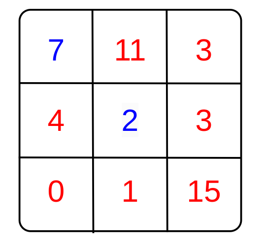
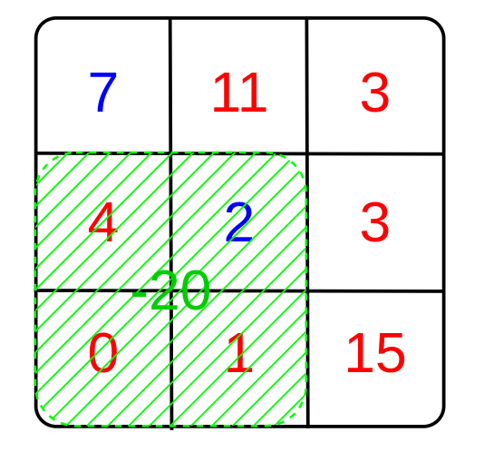
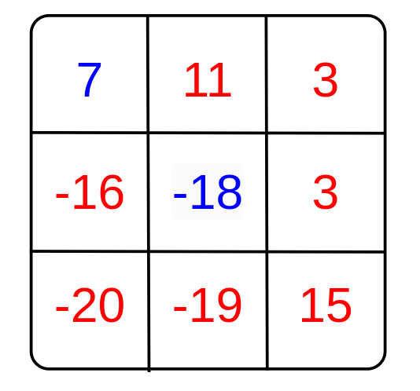
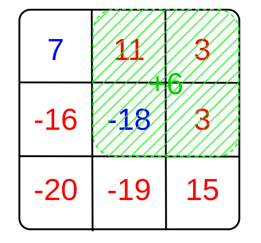
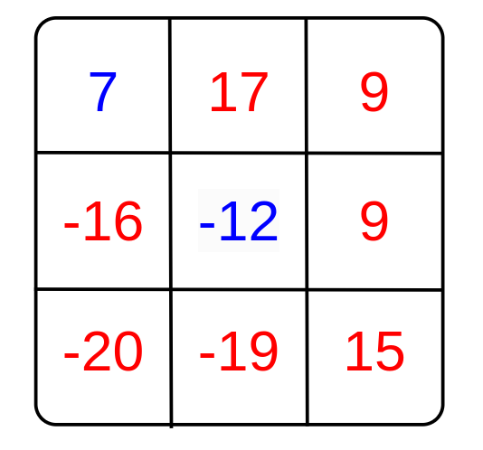

<h1 style='text-align: center;'> D. Beauty of the mountains</h1>

<h5 style='text-align: center;'>time limit per test: 2 seconds</h5>
<h5 style='text-align: center;'>memory limit per test: 256 megabytes</h5>

Nikita loves mountains and has finally decided to visit the Berlyand mountain range! The range was so beautiful that Nikita decided to capture it on a map. The map is a table of $n$ rows and $m$ columns, with each cell containing a non-negative integer representing the height of the mountain.

He also noticed that mountains come in two types:

* With snowy caps.
* Without snowy caps.

Nikita is a very pragmatic person. He wants the sum of the heights of the mountains with snowy caps to be equal to the sum of the heights of the mountains without them. He has arranged with the mayor of Berlyand, Polikarp Polikarpovich, to allow him to transform the landscape.

Nikita can perform transformations on submatrices of size $k \times k$ as follows: he can add an integer constant $c$ to the heights of the mountains within this area, but the type of the mountain remains unchanged. Nikita can choose the constant $c$ independently for each transformation. ## Note

 that $c$ can be negative.

Before making the transformations, Nikita asks you to find out if it is possible to achieve equality of the sums, or if it is impossible. It doesn't matter at what cost, even if the mountains turn into canyons and have negative heights.

If only one type of mountain is represented on the map, then the sum of the heights of the other type of mountain is considered to be zero.

## Input

Each test consists of several test cases. The first line contains an integer $t$ ($1 \le t \le 10^{4}$) — the number of test cases. This is followed by a description of test cases.

The first line of each test case contains three integers $n, m, k$ ($1 \le n, m \le 500, 1 \le k \le min(n, m)$).

The next $n$ lines of each test case contain $m$ integers $a_{i j}$ ($0 \le a_{i j} \le 10^{9}$) — the initial heights of the mountains.

The next $n$ binary strings of length $m$ for each test case determine the type of mountain, '$0$' — with snowy caps, '$1$' — without them.

It is guaranteed that the sum of $n \cdot m$ for all test cases does not exceed $250\,000$.

## Output

For each test case, output "YES" without quotes if it is possible to equalize the sums of the mountain heights, otherwise output "NO" without quotes. You can output each letter in any case (for example, the strings "yEs", "yes", "Yes", and "YES" will be recognized as a positive answer).

## Example

## Input


```

83 3 27 11 34 2 30 1 151000100004 4 3123 413 24 233123 42 0 21622 1 1 53427 763 22 601011111101001013 3 22 1 11 1 21 5 40101010103 3 22 1 11 1 21 5 30101010103 4 346 49 50 119 30 23 1230 25 1 461000010000105 4 439 30 0 1722 42 30 1310 44 46 3512 19 9 3921 0 45 40100011110011011111002 2 23 46 700002 2 20 02 00100
```
## Output


```

YES
NO
YES
NO
YES
NO
YES
YES

```
## Note

The mountain array from the first test case looks like this:

  Initially, the sum of the heights of the mountains with snowy caps is $11 + 3 + 4 + 3 + 0 + 1 + 15 = 37$, and without them is $7 + 2 = 9$.

To equalize these sums, we can perform two transformations:

First transformation:

  ## Note

 that the constant $c$ can be negative.

After the first transformation, the mountain array looks like this:

  Second transformation:

  As a result, the mountain array looks like this:

  The sum of the heights of the mountains with snowy caps is $17 + 9 + 9 - 16 - 20 - 19 + 15 = -5$, and without them is $7 - 12 = -5$, thus the answer is YES.


#### tags 

#1700 #brute_force #data_structures #implementation #math #number_theory 