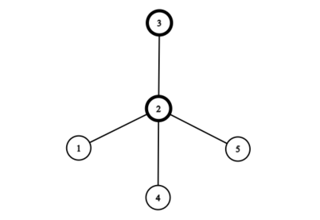

<h1 style='text-align: center;'> E. Shuffle</h1>

<h5 style='text-align: center;'>time limit per test: 2 seconds</h5>
<h5 style='text-align: center;'>memory limit per test: 256 megabytes</h5>

Two hungry red pandas, Oscar and Lura, have a tree $T$ with $n$ nodes. They are willing to perform the following shuffle procedure on the whole tree $T$ exactly once. With this shuffle procedure, they will create a new tree out of the nodes of the old tree. 

1. Choose any node $V$ from the original tree $T$. Create a new tree $T_2$, with $V$ as the root.
2. Remove $V$ from $T$, such that the original tree is split into one or more subtrees (or zero subtrees, if $V$ is the only node in $T$).
3. Shuffle each subtree with the same procedure (again choosing any node as the root), then connect all shuffled subtrees' roots back to $V$ to finish constructing $T_2$.

After this, Oscar and Lura are left with a new tree $T_2$. They can only eat leaves and are very hungry, so please find the maximum number of leaves over all trees that can be created in exactly one shuffle.

## Note

 that leaves are all nodes with degree $1$. Thus, the root may be considered as a leaf if it has only one child.

## Input

The first line contains a single integer $t$ ($1 \leq t \leq 10^4$) — the number of test cases.

The first line of every test case contains a single integer $n$ ($2 \leq n \leq 2 \cdot 10^5$) — the number of nodes within the original tree $T$.

The next $n - 1$ lines each contain two integers $u$ and $v$ ($1 \leq u, v \leq n$) — an edge within the original tree $T$. The given edges form a tree.

The sum of $n$ over all test cases does not exceed $3 \cdot 10^5$.

## Output

For each test case, output a single integer — the maximum number of leaves achievable with exactly one shuffle procedure on the whole tree.

## Example

## Input


```

451 21 32 42 551 22 33 44 561 21 31 41 51 6109 38 110 68 57 84 61 310 12 7
```
## Output


```

4
3
5
6

```
## Note

In the first test case, it can be shown that the maximum number of leaves is $4$. To accomplish this, we can start our shuffle with selecting node $3$ as the new root. 

   Next, we are left only with one subtree, in which we can select node $2$ to be the new root of that subtree.    This will force all $3$ remaining nodes to be leaves, and once we connect them back to our new root, the shuffled subtree looks like this:    We connect the shuffled subtree back to our new root of our new tree. Our final tree has four leaves (including the root), and looks like this:   In our second test case, we have a line of five nodes. It can be shown that the maximum number of leaves after one shuffle is $3$. We can start off with node $2$, which forces node $1$ to become a leaf. Then, if we select node $4$ on the right side, we will also have nodes $3$ and $5$ as leaves.

The third test case is a star graph with six nodes. The number of leaves cannot increase, thus our answer will be $5$ (if we start the shuffling with the original root node).


#### tags 

#2400 #dp #greedy #trees 