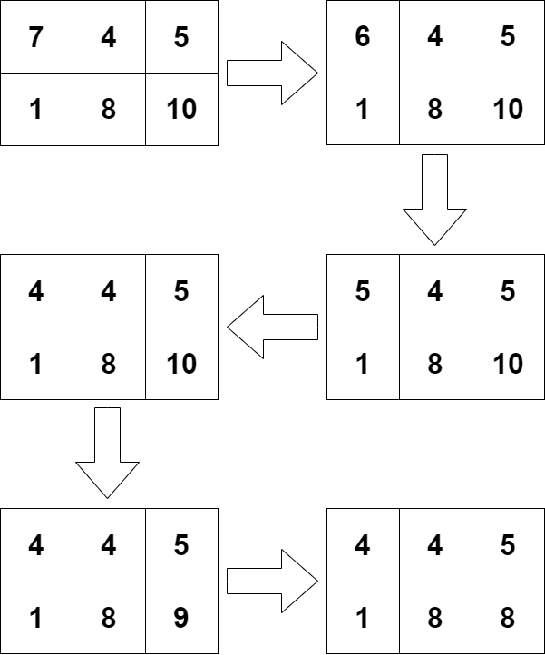

<h1 style='text-align: center;'> B. Matrix Stabilization</h1>

<h5 style='text-align: center;'>time limit per test: 2 seconds</h5>
<h5 style='text-align: center;'>memory limit per test: 256 megabytes</h5>

You are given a matrix of size $n \times m$, where the rows are numbered from $1$ to $n$ from top to bottom, and the columns are numbered from $1$ to $m$ from left to right. The element at the intersection of the $i$-th row and the $j$-th column is denoted by $a_{ij}$.

Consider the algorithm for stabilizing matrix $a$:

1. Find the cell $(i, j)$ such that its value is strictly greater than the values of all its neighboring cells. If there is no such cell, terminate the algorithm. If there are multiple such cells, choose the cell with the smallest value of $i$, and if there are still multiple cells, choose the one with the smallest value of $j$.
2. Set $a_{ij} = a_{ij} - 1$.
3. Go to step $1$.

In this problem, cells $(a, b)$ and $(c, d)$ are considered neighbors if they share a common side, i.e., $|a - c| + |b - d| = 1$.

Your task is to output the matrix $a$ after the stabilization algorithm has been executed. It can be shown that this algorithm cannot run for an infinite number of iterations.

## Input

Each test consists of multiple sets of input data. The first line contains a single integer $t$ ($1 \leq t \leq 10^4$) — the number of sets of input data. This is followed by their description.

The first line of each set of input data contains two integers $n$ and $m$ ($1 \leq n, m \leq 100, n \cdot m > 1$) — the number of rows and columns of matrix $a$. 

The next $n$ lines describe the corresponding rows of the matrix. The $i$-th line contains $m$ integers $a_{i1}, a_{i2}, \ldots, a_{im}$ ($1 \leq a_{ij} \leq 10^9$).

It is guaranteed that the sum of $n \cdot m$ over all sets of input data does not exceed $2 \cdot 10^5$.

## Output

For each set of input data, output $n$ lines with $m$ numbers in each line — the values of the cells of matrix $a$ after the stabilization algorithm.

## Example

## Input


```

61 23 12 1112 21 23 42 37 4 51 8 105 492 74 31 7474 92 17 731 17 92 374 7 3 927 31 1 13 31000000000 1 10000000001 1000000000 11000000000 1 1000000000
```
## Output


```

1 1 
1 
1 
1 2 
3 3 
4 4 5 
1 8 8 
74 74 31 31 
74 74 17 7 
31 17 17 3 
31 7 3 3 
7 7 1 1 
1 1 1 
1 1 1 
1 1 1 

```
## Note

In the first set of input data, the algorithm will select the cell $(1, 1)$ twice in a row and then terminate. 

  In the second set of input data, there is no cell whose value is strictly greater than the values of all neighboring cells.

In the third set of input data, the algorithm will select the cell $(2, 2)$ and then terminate. 

  In the fourth set of input data, the algorithm will select the cell $(1, 1)$ three times and then the cell $(2, 3)$ twice.

  

#### tags 

#1000 #brute_force #data_structures #greedy #sortings 