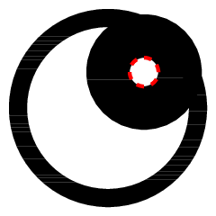
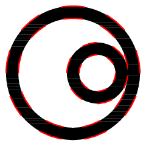
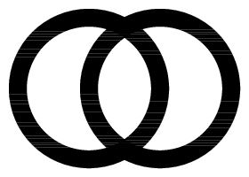

<h1 style='text-align: center;'> B. Special Olympics</h1>

<h5 style='text-align: center;'>time limit per test: 2 seconds</h5>
<h5 style='text-align: center;'>memory limit per test: 256 megabytes</h5>

A renowned abstract artist Sasha, drawing inspiration from nowhere, decided to paint a picture entitled "Special Olympics". He justly thought that, if the regular Olympic games have five rings, then the Special ones will do with exactly two rings just fine.

Let us remind you that a ring is a region located between two concentric circles with radii *r* and *R* (*r* < *R*). These radii are called internal and external, respectively. Concentric circles are circles with centers located at the same point.

Soon a white canvas, which can be considered as an infinite Cartesian plane, had two perfect rings, painted with solid black paint. As Sasha is very impulsive, the rings could have different radii and sizes, they intersect and overlap with each other in any way. We know only one thing for sure: the centers of the pair of rings are not the same.

When Sasha got tired and fell into a deep sleep, a girl called Ilona came into the room and wanted to cut a circle for the sake of good memories. To make the circle beautiful, she decided to cut along the contour.

We'll consider a contour to be a continuous closed line through which there is transition from one color to another (see notes for clarification). If the contour takes the form of a circle, then the result will be cutting out a circle, which Iona wants.

But the girl's inquisitive mathematical mind does not rest: how many ways are there to cut a circle out of the canvas?

## Input

The input contains two lines. 

Each line has four space-separated integers *x**i*, *y**i*, *r**i*, *R**i*, that describe the *i*-th ring; *x**i* and *y**i* are coordinates of the ring's center, *r**i* and *R**i* are the internal and external radii of the ring correspondingly ( - 100 ≤ *x**i*, *y**i* ≤ 100; 1 ≤ *r**i* < *R**i* ≤ 100). 

It is guaranteed that the centers of the rings do not coinside.

## Output

A single integer — the number of ways to cut out a circle from the canvas.

## Examples

## Input


```
60 60 45 55  
80 80 8 32  

```
## Output


```
1
```
## Input


```
60 60 45 55  
80 60 15 25  

```
## Output


```
4
```
## Input


```
50 50 35 45  
90 50 35 45  

```
## Output


```
0
```
## Note

Figures for test samples are given below. The possible cuts are marked with red dotted line. 

    

#### tags 

#1900 #geometry 