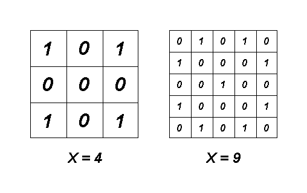

<h1 style='text-align: center;'> A. Clear Symmetry</h1>

<h5 style='text-align: center;'>time limit per test: 2 seconds</h5>
<h5 style='text-align: center;'>memory limit per test: 256 megabytes</h5>

Consider some square matrix *A* with side *n* consisting of zeros and ones. There are *n* rows numbered from 1 to *n* from top to bottom and *n* columns numbered from 1 to *n* from left to right in this matrix. We'll denote the element of the matrix which is located at the intersection of the *i*-row and the *j*-th column as *A**i*, *j*.

Let's call matrix *A* clear if no two cells containing ones have a common side.

Let's call matrix *A* symmetrical if it matches the matrices formed from it by a horizontal and/or a vertical reflection. Formally, for each pair (*i*, *j*) (1 ≤ *i*, *j* ≤ *n*) both of the following conditions must be met: *A**i*, *j* = *A**n* - *i* + 1, *j* and *A**i*, *j* = *A**i*, *n* - *j* + 1.

Let's define the sharpness of matrix *A* as the number of ones in it.

Given integer *x*, your task is to find the smallest positive integer *n* such that there exists a clear symmetrical matrix *A* with side *n* and sharpness *x*.

## Input

The only line contains a single integer *x* (1 ≤ *x* ≤ 100) — the required sharpness of the matrix.

## Output

Print a single number — the sought value of *n*.

## Examples

## Input


```
4  

```
## Output


```
3  

```
## Input


```
9  

```
## Output


```
5  

```
## Note

The figure below shows the matrices that correspond to the samples:

  

#### tags 

#1700 #constructive_algorithms #dp #math 