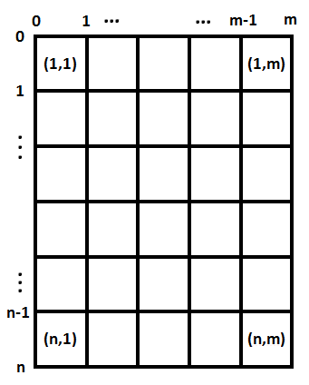

<h1 style='text-align: center;'> B. Guess That Car!</h1>

<h5 style='text-align: center;'>time limit per test: 2 seconds</h5>
<h5 style='text-align: center;'>memory limit per test: 256 megabytes</h5>

A widely known among some people Belarusian sport programmer Yura possesses lots of information about cars. That is why he has been invited to participate in a game show called "Guess That Car!".

The game show takes place on a giant parking lot, which is 4*n* meters long from north to south and 4*m* meters wide from west to east. The lot has *n* + 1 dividing lines drawn from west to east and *m* + 1 dividing lines drawn from north to south, which divide the parking lot into *n*·*m* 4 by 4 meter squares. There is a car parked strictly inside each square. The dividing lines are numbered from 0 to *n* from north to south and from 0 to *m* from west to east. Each square has coordinates (*i*, *j*) so that the square in the north-west corner has coordinates (1, 1) and the square in the south-east corner has coordinates (*n*, *m*). See the picture in the notes for clarifications.

Before the game show the organizers offer Yura to occupy any of the (*n* + 1)·(*m* + 1) intersection points of the dividing lines. After that he can start guessing the cars. After Yura chooses a point, he will be prohibited to move along the parking lot before the end of the game show. As Yura is a car expert, he will always guess all cars he is offered, it's just a matter of time. Yura knows that to guess each car he needs to spend time equal to the square of the euclidean distance between his point and the center of the square with this car, multiplied by some coefficient characterizing the machine's "rarity" (the rarer the car is, the harder it is to guess it). More formally, guessing a car with "rarity" *c* placed in a square whose center is at distance *d* from Yura takes *c*·*d*2 seconds. The time Yura spends on turning his head can be neglected.

It just so happened that Yura knows the "rarity" of each car on the parking lot in advance. Help him choose his point so that the total time of guessing all cars is the smallest possible.

## Input

The first line contains two integers *n* and *m* (1 ≤ *n*, *m* ≤ 1000) — the sizes of the parking lot. Each of the next *n* lines contains *m* integers: the *j*-th number in the *i*-th line describes the "rarity" *c**ij* (0 ≤ *c**ij* ≤ 100000) of the car that is located in the square with coordinates (*i*, *j*).

## Output

In the first line print the minimum total time Yura needs to guess all offered cars. In the second line print two numbers *l**i* and *l**j* (0 ≤ *l**i* ≤ *n*, 0 ≤ *l**j* ≤ *m*) — the numbers of dividing lines that form a junction that Yura should choose to stand on at the beginning of the game show. If there are multiple optimal starting points, print the point with smaller *l**i*. If there are still multiple such points, print the point with smaller *l**j*.

Please do not use the %lld specifier to read or write 64-bit integers in С++. It is preferred to use the cin, cout streams or the %I64d specifier.

## Examples

## Input


```
2 3  
3 4 5  
3 9 1  

```
## Output


```
392  
1 1  

```
## Input


```
3 4  
1 0 0 0  
0 0 3 0  
0 0 5 5  

```
## Output


```
240  
2 3  

```
## Note

In the first test case the total time of guessing all cars is equal to 3·8 + 3·8 + 4·8 + 9·8 + 5·40 + 1·40 = 392.

The coordinate system of the field: 

  

#### tags 

#1800 #math #ternary_search 