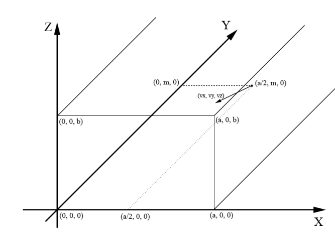

<h1 style='text-align: center;'> D. Hit Ball</h1>

<h5 style='text-align: center;'>time limit per test: 2 seconds</h5>
<h5 style='text-align: center;'>memory limit per test: 256 megabytes</h5>

When Valera was playing football on a stadium, it suddenly began to rain. Valera hid in the corridor under the grandstand not to get wet. However, the desire to play was so great that he decided to train his hitting the ball right in this corridor. Valera went back far enough, put the ball and hit it. The ball bounced off the walls, the ceiling and the floor corridor and finally hit the exit door. As the ball was wet, it left a spot on the door. Now Valera wants to know the coordinates for this spot.

Let's describe the event more formally. The ball will be considered a point in space. The door of the corridor will be considered a rectangle located on plane *xOz*, such that the lower left corner of the door is located at point (0, 0, 0), and the upper right corner is located at point (*a*, 0, *b*) . The corridor will be considered as a rectangular parallelepiped, infinite in the direction of increasing coordinates of *y*. In this corridor the floor will be considered as plane *xOy*, and the ceiling as plane, parallel to *xOy* and passing through point (*a*, 0, *b*). We will also assume that one of the walls is plane *yOz*, and the other wall is plane, parallel to *yOz* and passing through point (*a*, 0, *b*).

We'll say that the ball hit the door when its coordinate *y* was equal to 0. Thus the coordinates of the spot are point (*x*0, 0, *z*0), where 0 ≤ *x*0 ≤ *a*, 0 ≤ *z*0 ≤ *b*. To hit the ball, Valera steps away from the door at distance *m* and puts the ball in the center of the corridor at point . After the hit the ball flies at speed (*v**x*, *v**y*, *v**z*). This means that if the ball has coordinates (*x*, *y*, *z*), then after one second it will have coordinates (*x* + *v**x*, *y* + *v**y*, *z* + *v**z*).

See image in notes for clarification.

When the ball collides with the ceiling, the floor or a wall of the corridor, it bounces off in accordance with the laws of reflection (the angle of incidence equals the angle of reflection). In the problem we consider the ideal physical model, so we can assume that there is no air resistance, friction force, or any loss of energy.

## Input

The first line contains three space-separated integers *a*, *b*, *m* (1 ≤ *a*, *b*, *m* ≤ 100). The first two integers specify point (*a*, 0, *b*), through which the ceiling and one of the corridor walls pass. The third integer is the distance at which Valera went away from the door.

The second line has three space-separated integers *v**x*, *v**y*, *v**z* (|*v**x*|, |*v**y*|, |*v**z*| ≤ 100, *v**y* < 0, *v**z* ≥ 0) — the speed of the ball after the hit.

It is guaranteed that the ball hits the door.

## Output

Print two real numbers *x*0, *z*0 — the *x* and *z* coordinates of point (*x*0, 0, *z*0), at which the ball hits the exit door. The answer will be considered correct, if its absolute or relative error does not exceed 10 - 6.

## Examples

## Input


```
7 2 11  
3 -11 2  

```
## Output


```
6.5000000000 2.0000000000  

```
## Input


```
7 2 11  
4 -3 3  

```
## Output


```
4.1666666667 1.0000000000  

```
## Note




#### tags 

#1700 #geometry #implementation #math 