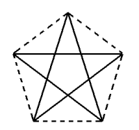
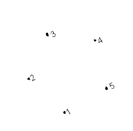
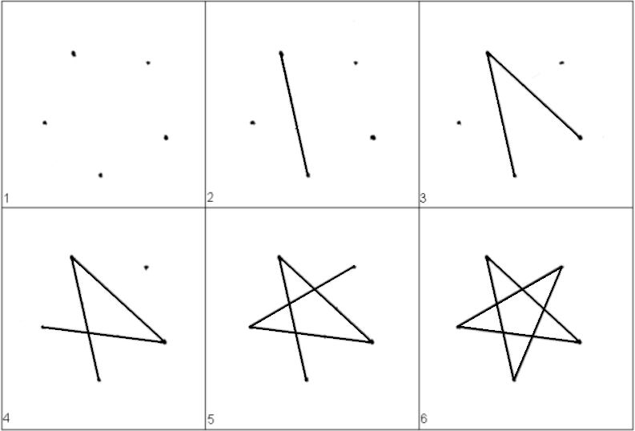

<h1 style='text-align: center;'> D. Stars</h1>

<h5 style='text-align: center;'>time limit per test: 2 seconds</h5>
<h5 style='text-align: center;'>memory limit per test: 256 megabytes</h5>

Furik loves painting stars. A star is a shape that results if we take a regular pentagon and paint all diagonals in it. 

  Recently he decided to teach Rubik to paint stars. After many years of training Rubik could paint stars easily. But now Furik decided to test Rubik and complicated the task. Rubik must paint *n* stars, observing the following rules:

* all stars must be painted in a single move (i.e. it is forbidden to take the pen away from the paper);
* it is forbidden to paint the same segment of non-zero length more than once;
* the stars can intersect only in their vertexes;
* the length of a side of the regular pentagon, in which Rubik paints each star, must equal 10.

Help Rubik to cope with this hard task.

## Input

A single line contains an integer (1 ≤ *n* ≤ 100) — the number of stars to paint.

## Output

On the first line print an integer *m* (1 ≤ *m* ≤ 5·*n*). On the next *m* lines print coordinates of *m* distinct points with accuracy of at least 9 and at most 100 digits after decimal point. All coordinates should not exceed 5000 in their absolute value. On each of the next *n* lines print 5 integers — the indexes of the points that form the given star in the clockwise or counterclockwise order. On the next line print 5·*n* + 1 integers — the numbers of points in the order, in which Rubik paints stars. That is, if number with index *i* is *a**i*, and number with index *i* + 1 is *a**i* + 1, then points with indexes *a**i* and *a**i* + 1 will have a segment painted between them. 

You can consider all *m* printed points indexed from 1 to *m* in the order, in which they occur in the output. Separate the numbers on the lines with whitespaces.

## Note

 that the answer has an imprecise validation. Try to obtain as accurate a solution as possible. The validator performs all calculations considering that the absolute error of a participant's answer is not more than 10- 8.

## Examples

## Input


```
1  

```
## Output


```
5  
3.830127018922193 3.366025403784439  
-3.601321235851749 10.057331467373021  
0.466045194906253 19.192786043799030  
10.411264148588986 18.147501411122495  
12.490381056766580 8.366025403784439  
1 2 3 4 5  
1 3 5 2 4 1  

```
## Note

The initial position of points in the sample is:

  The order in which Rubik can paint segments is:

  

#### tags 

#2300 #constructive_algorithms #geometry 