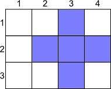

<h1 style='text-align: center;'> C. Crosses</h1>

<h5 style='text-align: center;'>time limit per test: 2 seconds</h5>
<h5 style='text-align: center;'>memory limit per test: 256 megabytes</h5>

There is a board with a grid consisting of *n* rows and *m* columns, the rows are numbered from 1 from top to bottom and the columns are numbered from 1 from left to right. In this grid we will denote the cell that lies on row number *i* and column number *j* as (*i*, *j*).

A group of six numbers (*a*, *b*, *c*, *d*, *x*0, *y*0), where 0 ≤ *a*, *b*, *c*, *d*, is a cross, and there is a set of cells that are assigned to it. Cell (*x*, *y*) belongs to this set if at least one of two conditions are fulfilled:

* |*x*0 - *x*| ≤ *a* and |*y*0 - *y*| ≤ *b*
* |*x*0 - *x*| ≤ *c* and |*y*0 - *y*| ≤ *d*

   The picture shows the cross (0, 1, 1, 0, 2, 3) on the grid 3 × 4.  Your task is to find the number of different groups of six numbers, (*a*, *b*, *c*, *d*, *x*0, *y*0) that determine the crosses of an area equal to *s*, which are placed entirely on the grid. The cross is placed entirely on the grid, if any of its cells is in the range of the grid (that is for each cell (*x*, *y*) of the cross 1 ≤ *x* ≤ *n*; 1 ≤ *y* ≤ *m* holds). The area of the cross is the number of cells it has.

## Note

 that two crosses are considered distinct if the ordered groups of six numbers that denote them are distinct, even if these crosses coincide as sets of points.

## Input

The input consists of a single line containing three integers *n*, *m* and *s* (1 ≤ *n*, *m* ≤ 500, 1 ≤ *s* ≤ *n*·*m*). The integers are separated by a space.

## Output

Print a single integer — the number of distinct groups of six integers that denote crosses with area *s* and that are fully placed on the *n* × *m* grid.

Please, do not use the %lld specifier to read or write 64-bit integers in С++. It is preferred to use the cin, cout streams or the %I64d specifier.

## Examples

## Input


```
2 2 1  

```
## Output


```
4  

```
## Input


```
3 4 5  

```
## Output


```
4  

```
## Note

In the first sample the sought groups of six numbers are: (0, 0, 0, 0, 1, 1), (0, 0, 0, 0, 1, 2), (0, 0, 0, 0, 2, 1), (0, 0, 0, 0, 2, 2).

In the second sample the sought groups of six numbers are: (0, 1, 1, 0, 2, 2), (0, 1, 1, 0, 2, 3), (1, 0, 0, 1, 2, 2), (1, 0, 0, 1, 2, 3).


#### tags 

#2100 #brute_force #implementation 