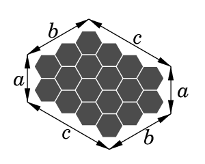

<h1 style='text-align: center;'> A. Tiling with Hexagons</h1>

<h5 style='text-align: center;'>time limit per test: 2 seconds</h5>
<h5 style='text-align: center;'>memory limit per test: 256 megabytes</h5>

Several ages ago Berland was a kingdom. The King of Berland adored math. That's why, when he first visited one of his many palaces, he first of all paid attention to the floor in one hall. The floor was tiled with hexagonal tiles.

The hall also turned out hexagonal in its shape. The King walked along the perimeter of the hall and concluded that each of the six sides has *a*, *b*, *c*, *a*, *b* and *c* adjacent tiles, correspondingly.

To better visualize the situation, look at the picture showing a similar hexagon for *a* = 2, *b* = 3 and *c* = 4.

  According to the legend, as the King of Berland obtained the values *a*, *b* and *c*, he almost immediately calculated the total number of tiles on the hall floor. Can you do the same?

## Input

The first line contains three integers: *a*, *b* and *c* (2 ≤ *a*, *b*, *c* ≤ 1000).

## Output

Print a single number — the total number of tiles on the hall floor.

## Examples

## Input


```
2 3 4  

```
## Output


```
18
```


#### tags 

#1200 #implementation #math 