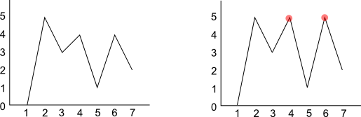

<h1 style='text-align: center;'> A. Mountain Scenery</h1>

<h5 style='text-align: center;'>time limit per test: 2 seconds</h5>
<h5 style='text-align: center;'>memory limit per test: 256 megabytes</h5>

Little Bolek has found a picture with *n* mountain peaks painted on it. The *n* painted peaks are represented by a non-closed polyline, consisting of 2*n* segments. The segments go through 2*n* + 1 points with coordinates (1, *y*1), (2, *y*2), ..., (2*n* + 1, *y*2*n* + 1), with the *i*-th segment connecting the point (*i*, *y**i*) and the point (*i* + 1, *y**i* + 1). For any even *i* (2 ≤ *i* ≤ 2*n*) the following condition holds: *y**i* - 1 < *y**i* and *y**i* > *y**i* + 1. 

We shall call a vertex of a polyline with an even *x* coordinate a mountain peak.

   The figure to the left shows the initial picture, the figure to the right shows what the picture looks like after Bolek's actions. The affected peaks are marked red, *k* = 2.  Bolek fancied a little mischief. He chose exactly *k* mountain peaks, rubbed out the segments that went through those peaks and increased each peak's height by one (that is, he increased the *y* coordinate of the corresponding points). Then he painted the missing segments to get a new picture of mountain peaks. Let us denote the points through which the new polyline passes on Bolek's new picture as (1, *r*1), (2, *r*2), ..., (2*n* + 1, *r*2*n* + 1).

Given Bolek's final picture, restore the initial one.

## Input

The first line contains two space-separated integers *n* and *k* (1 ≤ *k* ≤ *n* ≤ 100). The next line contains 2*n* + 1 space-separated integers *r*1, *r*2, ..., *r*2*n* + 1 (0 ≤ *r**i* ≤ 100) — the *y* coordinates of the polyline vertices on Bolek's picture.

It is guaranteed that we can obtain the given picture after performing the described actions on some picture of mountain peaks.

## Output

Print 2*n* + 1 integers *y*1, *y*2, ..., *y*2*n* + 1 — the *y* coordinates of the vertices of the polyline on the initial picture. If there are multiple answers, output any one of them.

## Examples

## Input


```
3 2  
0 5 3 5 1 5 2  

```
## Output


```
0 5 3 4 1 4 2   

```
## Input


```
1 1  
0 2 0  

```
## Output


```
0 1 0   

```


#### tags 

#1100 #brute_force #constructive_algorithms #implementation 