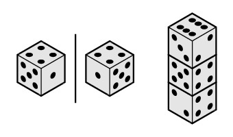

<h1 style='text-align: center;'> A. Dice Tower</h1>

<h5 style='text-align: center;'>time limit per test: 2 seconds</h5>
<h5 style='text-align: center;'>memory limit per test: 256 megabytes</h5>

A dice is a cube, its faces contain distinct integers from 1 to 6 as black points. The sum of numbers at the opposite dice faces always equals 7. Please note that there are only two dice (these dices are mirror of each other) that satisfy the given constraints (both of them are shown on the picture on the left).

  Alice and Bob play dice. Alice has built a tower from *n* dice. We know that in this tower the adjacent dice contact with faces with distinct numbers. Bob wants to uniquely identify the numbers written on the faces of all dice, from which the tower is built. Unfortunately, Bob is looking at the tower from the face, and so he does not see all the numbers on the faces. Bob sees the number on the top of the tower and the numbers on the two adjacent sides (on the right side of the picture shown what Bob sees).

Help Bob, tell whether it is possible to uniquely identify the numbers on the faces of all the dice in the tower, or not.

## Input

The first line contains a single integer *n* (1 ≤ *n* ≤ 100) — the number of dice in the tower.

The second line contains an integer *x* (1 ≤ *x* ≤ 6) — the number Bob sees at the top of the tower. Next *n* lines contain two space-separated integers each: the *i*-th line contains numbers *a**i*, *b**i* (1 ≤ *a**i*, *b**i* ≤ 6; *a**i* ≠ *b**i*) — the numbers Bob sees on the two sidelong faces of the *i*-th dice in the tower.

Consider the dice in the tower indexed from top to bottom from 1 to *n*. That is, the topmost dice has index 1 (the dice whose top face Bob can see). It is guaranteed that it is possible to make a dice tower that will look as described in the input.

## Output

Print "YES" (without the quotes), if it is possible to to uniquely identify the numbers on the faces of all the dice in the tower. If it is impossible, print "NO" (without the quotes).

## Examples

## Input


```
3  
6  
3 2  
5 4  
2 4  

```
## Output


```
YES
```
## Input


```
3  
3  
2 6  
4 1  
5 3  

```
## Output


```
NO
```


#### tags 

#1100 #constructive_algorithms #greedy 