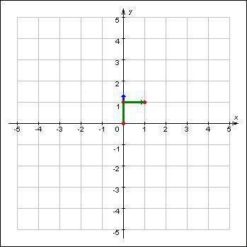
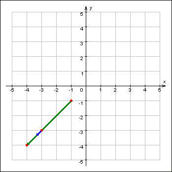

<h1 style='text-align: center;'> A. Where do I Turn?</h1>

<h5 style='text-align: center;'>time limit per test: 2 seconds</h5>
<h5 style='text-align: center;'>memory limit per test: 256 megabytes</h5>

Trouble came from the overseas lands: a three-headed dragon Gorynych arrived. The dragon settled at point *C* and began to terrorize the residents of the surrounding villages.

A brave hero decided to put an end to the dragon. He moved from point *A* to fight with Gorynych. The hero rode from point *A* along a straight road and met point *B* on his way. The hero knows that in this land for every pair of roads it is true that they are either parallel to each other, or lie on a straight line, or are perpendicular to each other. He also knows well that points *B* and *C* are connected by a road. So the hero must either turn 90 degrees to the left or continue riding straight ahead or turn 90 degrees to the right. But he forgot where the point *C* is located.

Fortunately, a Brave Falcon flew right by. It can see all three points from the sky. The hero asked him what way to go to get to the dragon's lair.

If you have not got it, you are the falcon. Help the hero and tell him how to get him to point *C*: turn left, go straight or turn right.

At this moment the hero is believed to stand at point *B*, turning his back to point *A*.

## Input

The first input line contains two space-separated integers *x**a*, *y**a* (|*x**a*|, |*y**a*| ≤ 109) — the coordinates of point *A*. The second line contains the coordinates of point *B* in the same form, the third line contains the coordinates of point *C*.

It is guaranteed that all points are pairwise different. It is also guaranteed that either point *B* lies on segment *AC*, or angle *ABC* is right.

## Output

Print a single line. If a hero must turn left, print "LEFT" (without the quotes); If he must go straight ahead, print "TOWARDS" (without the quotes); if he should turn right, print "RIGHT" (without the quotes).

## Examples

## Input


```
0 0  
0 1  
1 1  

```
## Output


```
RIGHT  

```
## Input


```
-1 -1  
-3 -3  
-4 -4  

```
## Output


```
TOWARDS  

```
## Input


```
-4 -6  
-3 -7  
-2 -6  

```
## Output


```
LEFT  

```
## Note

The picture to the first sample: 

The red color shows points A, B and C. The blue arrow shows the hero's direction. The green color shows the hero's trajectory.

The picture to the second sample: 



#### tags 

#1300 #geometry 