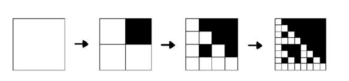
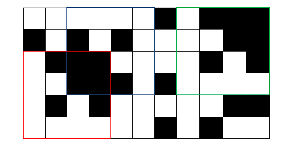
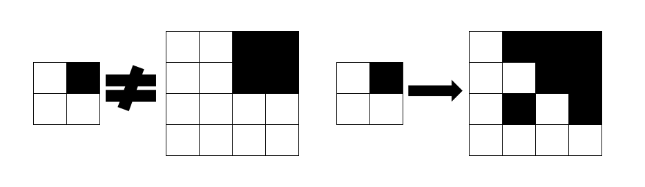

<h1 style='text-align: center;'> C. Fractal Detector</h1>

<h5 style='text-align: center;'>time limit per test: 4 seconds</h5>
<h5 style='text-align: center;'>memory limit per test: 256 megabytes</h5>

Little Vasya likes painting fractals very much.

He does it like this. First the boy cuts out a 2 × 2-cell square out of squared paper. Then he paints some cells black. The boy calls the cut out square a fractal pattern. Then he takes a clean square sheet of paper and paints a fractal by the following algorithm:

1. He divides the sheet into four identical squares. A part of them is painted black according to the fractal pattern.
2. Each square that remained white, is split into 4 lesser white squares, some of them are painted according to the fractal pattern. Each square that remained black, is split into 4 lesser black squares.

 In each of the following steps step 2 repeats. To draw a fractal, the boy can make an arbitrary positive number of steps of the algorithm. But he need to make at least two steps. In other words step 2 of the algorithm must be done at least once. The resulting picture (the square with painted cells) will be a fractal. The figure below shows drawing a fractal (here boy made three steps of the algorithm).

  One evening Vasya got very tired, so he didn't paint the fractal, he just took a sheet of paper, painted a *n* × *m*-cell field. Then Vasya paint some cells black. 

Now he wonders, how many squares are on the field, such that there is a fractal, which can be obtained as described above, and which is equal to that square. Square is considered equal to some fractal if they consist of the same amount of elementary not divided cells and for each elementary cell of the square corresponding elementary cell of the fractal have the same color.

## Input

The first line contains two space-separated integers *n*, *m* (2 ≤ *n*, *m* ≤ 500) — the number of rows and columns of the field, correspondingly. 

Next *n* lines contain *m* characters each — the description of the field, painted by Vasya. Character "." represents a white cell, character "*" represents a black cell.

It is guaranteed that the field description doesn't contain other characters than "." and "*".

## Output

On a single line print a single integer — the number of squares on the field, such that these squares contain a drawn fractal, which can be obtained as described above.

## Examples

## Input


```
6 11  
......*.***  
*.*.*....**  
.***....*.*  
..***.*....  
.*.*.....**  
......*.*..  

```
## Output


```
3  

```
## Input


```
4 4  
..**  
..**  
....  
....  

```
## Output


```
0  

```
## Note

The answer for the first sample is shown on the picture below. Fractals are outlined by red, blue and green squares.

  The answer for the second sample is 0. There is no fractal, equal to the given picture.

  

#### tags 

#2000 #dp #hashing 