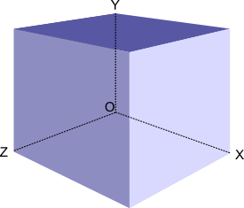

<h1 style='text-align: center;'> D. Magic Box</h1>

<h5 style='text-align: center;'>time limit per test: 2 seconds</h5>
<h5 style='text-align: center;'>memory limit per test: 256 megabytes</h5>

One day Vasya was going home when he saw a box lying on the road. The box can be represented as a rectangular parallelepiped. Vasya needed no time to realize that the box is special, as all its edges are parallel to the coordinate axes, one of its vertices is at point (0, 0, 0), and the opposite one is at point (*x*1, *y*1, *z*1). The six faces of the box contain some numbers *a*1, *a*2, ..., *a*6, exactly one number right in the center of each face.

  The numbers are located on the box like that: 

* number *a*1 is written on the face that lies on the ZOX plane;
* *a*2 is written on the face, parallel to the plane from the previous point;
* *a*3 is written on the face that lies on the XOY plane;
* *a*4 is written on the face, parallel to the plane from the previous point;
* *a*5 is written on the face that lies on the YOZ plane;
* *a*6 is written on the face, parallel to the plane from the previous point.

At the moment Vasya is looking at the box from point (*x*, *y*, *z*). Find the sum of numbers that Vasya sees. ## Note

 that all faces of the box are not transparent and Vasya can't see the numbers through the box. The picture contains transparent faces just to make it easier to perceive. You can consider that if Vasya is looking from point, lying on the plane of some face, than he can not see the number that is written on this face. It is enough to see the center of a face to see the corresponding number for Vasya. Also note that Vasya always reads correctly the *a**i* numbers that he sees, independently of their rotation, angle and other factors (that is, for example, if Vasya sees some *a**i* = 6, then he can't mistake this number for 9 and so on). 

## Input

The fist input line contains three space-separated integers *x*, *y* and *z* (|*x*|, |*y*|, |*z*| ≤ 106) — the coordinates of Vasya's position in space. The second line contains three space-separated integers *x*1, *y*1, *z*1 (1 ≤ *x*1, *y*1, *z*1 ≤ 106) — the coordinates of the box's vertex that is opposite to the vertex at point (0, 0, 0). The third line contains six space-separated integers *a*1, *a*2, ..., *a*6 (1 ≤ *a**i* ≤ 106) — the numbers that are written on the box faces. 

It is guaranteed that point (*x*, *y*, *z*) is located strictly outside the box.

## Output

Print a single integer — the sum of all numbers on the box faces that Vasya sees.

## Examples

## Input


```
2 2 2  
1 1 1  
1 2 3 4 5 6  

```
## Output


```
12  

```
## Input


```
0 0 10  
3 2 3  
1 2 3 4 5 6  

```
## Output


```
4  

```
## Note

The first sample corresponds to perspective, depicted on the picture. Vasya sees numbers *a*2 (on the top face that is the darkest), *a*6 (on the right face that is the lightest) and *a*4 (on the left visible face).

In the second sample Vasya can only see number *a*4.


#### tags 

#1600 #brute_force #geometry 