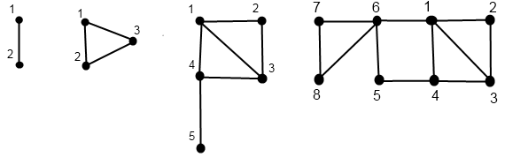

<h1 style='text-align: center;'> C. Doe Graphs</h1>

<h5 style='text-align: center;'>time limit per test: 3 seconds</h5>
<h5 style='text-align: center;'>memory limit per test: 256 megabytes</h5>

John Doe decided that some mathematical object must be named after him. So he invented the Doe graphs. The Doe graphs are a family of undirected graphs, each of them is characterized by a single non-negative number — its order. 

We'll denote a graph of order *k* as *D*(*k*), and we'll denote the number of vertices in the graph *D*(*k*) as |*D*(*k*)|. Then let's define the Doe graphs as follows:

* *D*(0) consists of a single vertex, that has number 1.
* *D*(1) consists of two vertices with numbers 1 and 2, connected by an edge.
* *D*(*n*) for *n* ≥ 2 is obtained from graphs *D*(*n* - 1) and *D*(*n* - 2). *D*(*n* - 1) and *D*(*n* - 2) are joined in one graph, at that numbers of all vertices of graph *D*(*n* - 2) increase by |*D*(*n* - 1)| (for example, vertex number 1 of graph *D*(*n* - 2) becomes vertex number 1 + |*D*(*n* - 1)|). After that two edges are added to the graph: the first one goes between vertices with numbers |*D*(*n* - 1)| and |*D*(*n* - 1)| + 1, the second one goes between vertices with numbers |*D*(*n* - 1)| + 1 and 1. Note that the definition of graph *D*(*n*) implies, that *D*(*n*) is a connected graph, its vertices are numbered from 1 to |*D*(*n*)|.

  The picture shows the Doe graphs of order 1, 2, 3 and 4, from left to right. John thinks that Doe graphs are that great because for them exists a polynomial algorithm for the search of Hamiltonian path. However, your task is to answer queries of finding the shortest-length path between the vertices *a**i* and *b**i* in the graph *D*(*n*).

A path between a pair of vertices *u* and *v* in the graph is a sequence of vertices *x*1, *x*2, ..., *x**k* (*k* > 1) such, that *x*1 = *u*, *x**k* = *v*, and for any *i* (*i* < *k*) vertices *x**i* and *x**i* + 1 are connected by a graph edge. The length of path *x*1, *x*2, ..., *x**k* is number (*k* - 1).

## Input

The first line contains two integers *t* and *n* (1 ≤ *t* ≤ 105; 1 ≤ *n* ≤ 103) — the number of queries and the order of the given graph. The *i*-th of the next *t* lines contains two integers *a**i* and *b**i* (1 ≤ *a**i*, *b**i* ≤ 1016, *a**i* ≠ *b**i*) — numbers of two vertices in the *i*-th query. It is guaranteed that *a**i*, *b**i* ≤ |*D*(*n*)|.

Please, do not use the %lld specifier to read or write 64-bit integers in С++. It is preferred to use cin, cout streams or the %I64d specifier. 

## Output

For each query print a single integer on a single line — the length of the shortest path between vertices *a**i* and *b**i*. Print the answers to the queries in the order, in which the queries are given in the input.

## Examples

## Input


```
10 5  
1 2  
1 3  
1 4  
1 5  
2 3  
2 4  
2 5  
3 4  
3 5  
4 5  

```
## Output


```
1  
1  
1  
2  
1  
2  
3  
1  
2  
1  

```


#### tags 

#2600 #constructive_algorithms #divide_and_conquer #dp #graphs #shortest_paths 