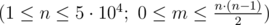

<h1 style='text-align: center;'> B. Friends</h1>

<h5 style='text-align: center;'>time limit per test: 6 seconds</h5>
<h5 style='text-align: center;'>memory limit per test: 256 megabytes</h5>

You have *n* friends and you want to take *m* pictures of them. Exactly two of your friends should appear in each picture and no two pictures should contain the same pair of your friends. So if you have *n* = 3 friends you can take 3 different pictures, each containing a pair of your friends.

Each of your friends has an attractiveness level which is specified by the integer number *a**i* for the *i*-th friend. You know that the attractiveness of a picture containing the *i*-th and the *j*-th friends is equal to the exclusive-or (*xor* operation) of integers *a**i* and *a**j*.

You want to take pictures in a way that the total sum of attractiveness of your pictures is maximized. You have to calculate this value. Since the result may not fit in a 32-bit integer number, print it modulo 1000000007 (109 + 7).

## Input

The first line of input contains two integers *n* and *m*  — the number of friends and the number of pictures that you want to take. 

Next line contains *n* space-separated integers *a*1, *a*2, ..., *a**n* (0 ≤ *a**i* ≤ 109) — the values of attractiveness of the friends.

## Output

The only line of output should contain an integer — the optimal total sum of attractiveness of your pictures.

## Examples

## Input


```
3 1  
1 2 3  

```
## Output


```
3  

```
## Input


```
3 2  
1 2 3  

```
## Output


```
5  

```
## Input


```
3 3  
1 2 3  

```
## Output


```
6  

```


#### tags 

#2700 #binary_search #bitmasks #data_structures #math 