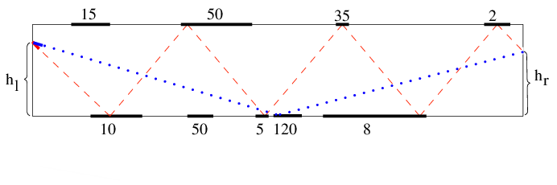

<h1 style='text-align: center;'> C. Mirror Box</h1>

<h5 style='text-align: center;'>time limit per test: 2 seconds</h5>
<h5 style='text-align: center;'>memory limit per test: 256 megabytes</h5>

Mirror Box is a name of a popular game in the Iranian National Amusement Park (INAP). There is a wooden box, 105 cm long and 100 cm high in this game. Some parts of the box's ceiling and floor are covered by mirrors. There are two negligibly small holes in the opposite sides of the box at heights *h**l* and *h**r* centimeters above the floor. The picture below shows what the box looks like.

  In the game, you will be given a laser gun to shoot once. The laser beam must enter from one hole and exit from the other one. Each mirror has a preset number *v**i*, which shows the number of points players gain if their laser beam hits that mirror. Also — to make things even funnier — the beam must not hit any mirror more than once.

Given the information about the box, your task is to find the maximum score a player may gain. Please note that the reflection obeys the law "the angle of incidence equals the angle of reflection".

## Input

The first line of the input contains three space-separated integers *h**l*, *h**r*, *n* (0 < *h**l*, *h**r* < 100, 0 ≤ *n* ≤ 100) — the heights of the holes and the number of the mirrors.

Next *n* lines contain the descriptions of the mirrors. The *i*-th line contains space-separated *v**i*, *c**i*, *a**i*, *b**i*; the integer *v**i* (1 ≤ *v**i* ≤ 1000) is the score for the *i*-th mirror; the character *c**i* denotes *i*-th mirror's position — the mirror is on the ceiling if *c**i* equals "T" and on the floor if *c**i* equals "F"; integers *a**i* and *b**i* (0 ≤ *a**i* < *b**i* ≤ 105) represent the *x*-coordinates of the beginning and the end of the mirror.

No two mirrors will share a common point. Consider that the *x* coordinate increases in the direction from left to right, so the border with the hole at height *h**l* has the *x* coordinate equal to 0 and the border with the hole at height *h**r* has the *x* coordinate equal to 105.

## Output

The only line of output should contain a single integer — the maximum possible score a player could gain.

## Examples

## Input


```
50 50 7  
10 F 1 80000  
20 T 1 80000  
30 T 81000 82000  
40 T 83000 84000  
50 T 85000 86000  
60 T 87000 88000  
70 F 81000 89000  

```
## Output


```
100  

```
## Input


```
80 72 9  
15 T 8210 15679  
10 F 11940 22399  
50 T 30600 44789  
50 F 32090 36579  
5 F 45520 48519  
120 F 49250 55229  
8 F 59700 80609  
35 T 61940 64939  
2 T 92540 97769  

```
## Output


```
120  

```
## Note

The second sample is depicted above. The red beam gets 10 + 50 + 5 + 35 + 8 + 2 = 110 points and the blue one gets 120.

The red beam on the picture given in the statement shows how the laser beam can go approximately, this is just illustration how the laser beam can gain score. So for the second sample there is no such beam that gain score 110.


#### tags 

#2000 #geometry #implementation 