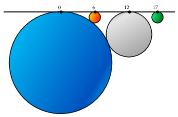
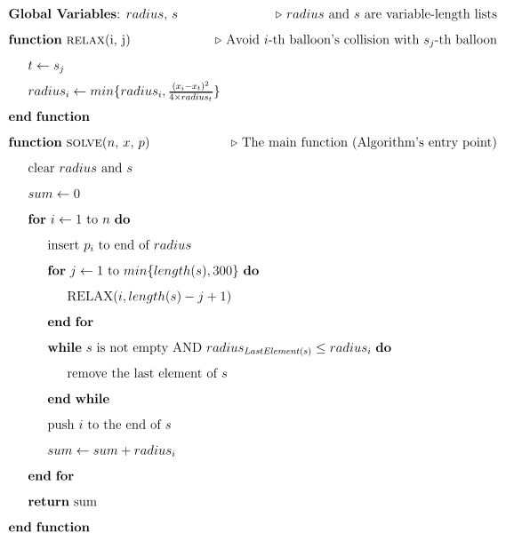

<h1 style='text-align: center;'> G. Challenging Balloons</h1>

<h5 style='text-align: center;'>time limit per test: 2 seconds</h5>
<h5 style='text-align: center;'>memory limit per test: 256 megabytes</h5>

Martha — as a professional problemsetter — proposed a problem for a world-class contest. This is the problem statement:

Tomorrow is Nadia's birthday, and Bardia (her brother) is assigned to make the balloons ready!

There are *n* balloons (initially empty) that are tied to a straight line on certain positions *x*1, *x*2, ..., *x**n*. Bardia inflates the balloons from left to right. As a result, *i*-th balloon gets bigger and bigger until its radius reaches the pressure endurance *p**i* or it touches another previously-inflated balloon.

  While Bardia was busy with the balloons, he wondered "What will be the sum of radius of balloons after all of the balloons are inflated?". Being a nerdy type of guy, he is now thinking about the problem instead of preparing his sister's birthday. Calculate the answer to Bardia's problem so that Nadia's birthday won't be balloon-less.

Artha — Martha's student — claimed his solution got accepted. Martha (being his teacher for a long time!) knew he couldn't have solved the problem for real and thus thinks there is something wrong with the testcases. Artha isn't anyhow logical, which means there is no way for Martha to explain the wrong point in his algorithm. So, the only way is to find a testcase to prove him wrong!

Artha's pseudo-code is shown below:

  You should output a small testcase for the problem such that Artha's algorithm is incorrect. The algorithm's output is considered correct if it differs from the correct value by no more than 1.

## Input

Please pay attention! No input will be given to your program for this problem. So you do not have to read from the input anything.

## Output

You should output the generated small testcase (which Artha's solution doesn't get it right). It should be in the following format:

* First line must contain the only number *n* (1 ≤ *n* ≤ 500).
* The *i*-th of the next *n* lines should contain the description of the *i*-th balloon — two space-separated integers *x**i*, *p**i* (1 ≤ *p**i* ≤ 106, 0 ≤ *x*1 < *x*2 < ... < *x**n* ≤ 106).
## Examples

## Note

The testcase depicted in the figure above (just showing how output should be formatted):


```
  
4  
0 9  
6 3  
12 7  
17 1  

```
 

#### tags 

#1900 #constructive_algorithms 