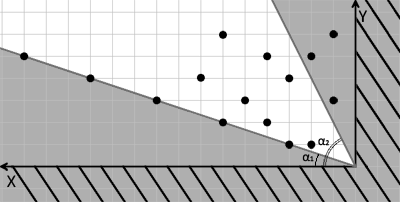
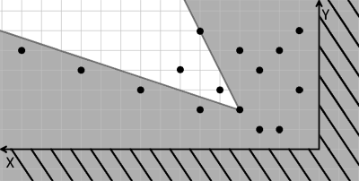
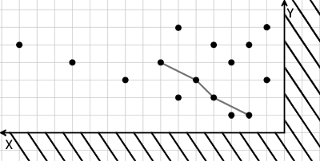

<h1 style='text-align: center;'> D. Donkey and Stars</h1>

<h5 style='text-align: center;'>time limit per test: 2 seconds</h5>
<h5 style='text-align: center;'>memory limit per test: 256 megabytes</h5>

In the evenings Donkey would join Shrek to look at the stars. They would sit on a log, sipping tea and they would watch the starry sky. The sky hung above the roof, right behind the chimney. Shrek's stars were to the right of the chimney and the Donkey's stars were to the left. Most days the Donkey would just count the stars, so he knew that they are exactly *n*. This time he wanted a challenge. He imagined a coordinate system: he put the origin of the coordinates at the intersection of the roof and the chimney, directed the *OX* axis to the left along the roof and the *OY* axis — up along the chimney (see figure). The Donkey imagined two rays emanating from he origin of axes at angles α1 and α2 to the *OX* axis.

  Now he chooses any star that lies strictly between these rays. After that he imagines more rays that emanate from this star at the same angles α1 and α2 to the *OX* axis and chooses another star that lies strictly between the new rays. He repeats the operation as long as there still are stars he can choose between the rays that emanate from a star. 

  As a result, the Donkey gets a chain of stars. He can consecutively get to each star if he acts by the given rules.

Your task is to find the maximum number of stars *m* that the Donkey's chain can contain.

## Note

 that the chain must necessarily start in the point of the origin of the axes, that isn't taken into consideration while counting the number *m* of stars in the chain.

## Input

The first line contains an integer *n* (1 ≤ *n* ≤ 105) — the number of stars. The second line contains simple fractions representing relationships "*a*/*b* *c*/*d*", such that  and  (0 ≤ *a*, *b*, *c*, *d* ≤ 105; ; ; ). The given numbers *a*, *b*, *c*, *d* are integers.

Next *n* lines contain pairs of integers *x**i*, *y**i* (1 ≤ *x**i*, *y**i* ≤ 105)— the stars' coordinates.

It is guaranteed that all stars have distinct coordinates.

## Output

In a single line print number *m* — the answer to the problem.

## Examples

## Input


```
15  
1/3 2/1  
3 1  
6 2  
4 2  
2 5  
4 5  
6 6  
3 4  
1 6  
2 1  
7 4  
9 3  
5 3  
1 3  
15 5  
12 4  

```
## Output


```
4  

```
## Note

In the sample the longest chain the Donkey can build consists of four stars. ## Note

 that the Donkey can't choose the stars that lie on the rays he imagines.

  

#### tags 

#2700 #data_structures #dp #geometry #math #sortings 