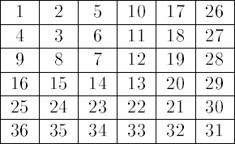

<h1 style='text-align: center;'> E. Endless Matrix</h1>

<h5 style='text-align: center;'>time limit per test: 3 seconds</h5>
<h5 style='text-align: center;'>memory limit per test: 256 megabytes</h5>

A Russian space traveller Alisa Selezneva, like any other schoolgirl of the late 21 century, is interested in science. She has recently visited the MIT (Moscow Institute of Time), where its chairman and the co-inventor of the time machine academician Petrov told her about the construction of a time machine.

During the demonstration of the time machine performance Alisa noticed that the machine does not have high speed and the girl got interested in the reason for such disadvantage. As it turns out on closer examination, one of the problems that should be solved for the time machine isn't solved by an optimal algorithm. If you find a way to solve this problem optimally, the time machine will run faster and use less energy.

A task that none of the staff can solve optimally is as follows. There exists a matrix *a*, which is filled by the following rule:

The cells are consecutive positive integers, starting with one. Besides, *a**i*, *j* < *a**t*, *k* (*i*, *j*, *t*, *k* ≥ 1), if:

1. *max*(*i*, *j*) < *max*(*t*, *k*);
2. *max*(*i*, *j*) = *max*(*t*, *k*) and *j* < *k*;
3. *max*(*i*, *j*) = *max*(*t*, *k*), *j* = *k* and *i* > *t*.

So, after the first 36 numbers are inserted, matrix *a* will look as follows:

  To solve the problem, you should learn to find rather quickly for the given values of *x*1, *y*1, *x*2 and *y*2 (*x*1 ≤ *x*2, *y*1 ≤ *y*2) the meaning of expression:

As the meaning of this expression can be large enough, it is sufficient to know only the last 10 digits of the sought value.

So, no one in MTI can solve the given task. Alice was brave enough to use the time machine and travel the past to help you.

Your task is to write a program that uses the given values *x*1, *y*1, *x*2 and *y*2 finds the last 10 digits of the given expression.

## Input

The first input line contains a single integer *t* (1 ≤ *t* ≤ 105) — the number of test sets for which you should solve the problem. 

Each of the next *t* lines contains the description of a test — four positive integers *x*1, *y*1, *x*2 and *y*2 (1 ≤ *x*1 ≤ *x*2 ≤ 109, 1 ≤ *y*1 ≤ *y*2 ≤ 109), separated by spaces.

## Output

For each query print the meaning of the expression if it contains at most 10 characters. Otherwise, print three characters "." (without the quotes), and then ten last digits of the time expression. Print the answer to each query on a single line. Follow the format, given in the sample as closely as possible.

## Examples

## Input


```
5  
1 1 1 1  
2 2 3 3  
2 3 5 6  
100 87 288 2002  
4 2 5 4  

```
## Output


```
1  
24  
300  
...5679392764  
111  

```


#### tags 

#2600 #math 