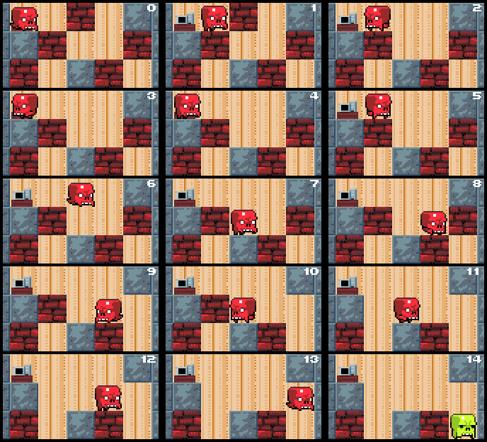

<h1 style='text-align: center;'> E. Mad Joe</h1>

<h5 style='text-align: center;'>time limit per test: 1 second</h5>
<h5 style='text-align: center;'>memory limit per test: 256 megabytes</h5>

Joe has been hurt on the Internet. Now he is storming around the house, destroying everything in his path.

Joe's house has *n* floors, each floor is a segment of *m* cells. Each cell either contains nothing (it is an empty cell), or has a brick or a concrete wall (always something one of three). It is believed that each floor is surrounded by a concrete wall on the left and on the right.

Now Joe is on the *n*-th floor and in the first cell, counting from left to right. At each moment of time, Joe has the direction of his gaze, to the right or to the left (always one direction of the two). Initially, Joe looks to the right.

Joe moves by a particular algorithm. Every second he makes one of the following actions: 

* If the cell directly under Joe is empty, then Joe falls down. That is, he moves to this cell, the gaze direction is preserved.
* Otherwise consider the next cell in the current direction of the gaze.
	+ If the cell is empty, then Joe moves into it, the gaze direction is preserved.
	+ If this cell has bricks, then Joe breaks them with his forehead (the cell becomes empty), and changes the direction of his gaze to the opposite.
	+ If this cell has a concrete wall, then Joe just changes the direction of his gaze to the opposite (concrete can withstand any number of forehead hits).

Joe calms down as soon as he reaches any cell of the first floor.

The figure below shows an example Joe's movements around the house.

  Determine how many seconds Joe will need to calm down.

## Input

The first line contains two integers *n* and *m* (2 ≤ *n* ≤ 100, 1 ≤ *m* ≤ 104).

Next *n* lines contain the description of Joe's house. The *i*-th of these lines contains the description of the (*n* - *i* + 1)-th floor of the house — a line that consists of *m* characters: "." means an empty cell, "+" means bricks and "#" means a concrete wall.

It is guaranteed that the first cell of the *n*-th floor is empty.

## Output

Print a single number — the number of seconds Joe needs to reach the first floor; or else, print word "Never" (without the quotes), if it can never happen.

Please, do not use the %lld specifier to read or write 64-bit integers in С++. It is preferred to use the cin, cout streams or the %I64d specifier.

## Examples

## Input


```
3 5  
..+.#  
#+..+  
+.#+.  

```
## Output


```
14
```
## Input


```
4 10  
...+.##+.+  
+#++..+++#  
++.#++++..  
.+##.++#.+  

```
## Output


```
42  

```
## Input


```
2 2  
..  
++  

```
## Output


```
Never
```


#### tags 

#2000 #brute_force 