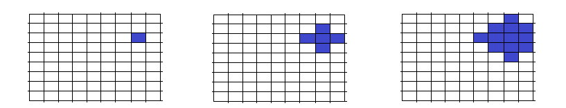

<h1 style='text-align: center;'> D. Mr. Bender and Square</h1>

<h5 style='text-align: center;'>time limit per test: 2 seconds</h5>
<h5 style='text-align: center;'>memory limit per test: 256 megabytes</h5>

Mr. Bender has a digital table of size *n* × *n*, each cell can be switched on or off. He wants the field to have at least *c* switched on squares. When this condition is fulfilled, Mr Bender will be happy.

We'll consider the table rows numbered from top to bottom from 1 to *n*, and the columns — numbered from left to right from 1 to *n*. Initially there is exactly one switched on cell with coordinates (*x*, *y*) (*x* is the row number, *y* is the column number), and all other cells are switched off. Then each second we switch on the cells that are off but have the side-adjacent cells that are on.

For a cell with coordinates (*x*, *y*) the side-adjacent cells are cells with coordinates (*x* - 1, *y*), (*x* + 1, *y*), (*x*, *y* - 1), (*x*, *y* + 1).

In how many seconds will Mr. Bender get happy?

## Input

The first line contains four space-separated integers *n*, *x*, *y*, *c* (1 ≤ *n*, *c* ≤ 109; 1 ≤ *x*, *y* ≤ *n*; *c* ≤ *n*2).

## Output

In a single line print a single integer — the answer to the problem.

## Examples

## Input


```
6 4 3 1  

```
## Output


```
0  

```
## Input


```
9 3 8 10  

```
## Output


```
2  

```
## Note

Initially the first test has one painted cell, so the answer is 0. In the second test all events will go as is shown on the figure. .


#### tags 

#1800 #binary_search #implementation #math 