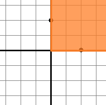
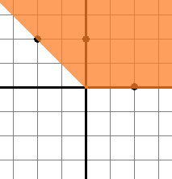
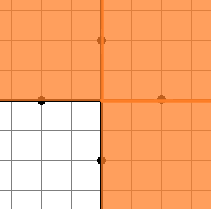
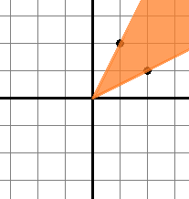

<h1 style='text-align: center;'> C. View Angle</h1>

<h5 style='text-align: center;'>time limit per test: 2 seconds</h5>
<h5 style='text-align: center;'>memory limit per test: 256 megabytes</h5>

Flatland has recently introduced a new type of an eye check for the driver's licence. The check goes like that: there is a plane with mannequins standing on it. You should tell the value of the minimum angle with the vertex at the origin of coordinates and with all mannequins standing inside or on the boarder of this angle. 

As you spend lots of time "glued to the screen", your vision is impaired. So you have to write a program that will pass the check for you.

## Input

The first line contains a single integer *n* (1 ≤ *n* ≤ 105) — the number of mannequins.

Next *n* lines contain two space-separated integers each: *x**i*, *y**i* (|*x**i*|, |*y**i*| ≤ 1000) — the coordinates of the *i*-th mannequin. It is guaranteed that the origin of the coordinates has no mannequin. It is guaranteed that no two mannequins are located in the same point on the plane.

## Output

Print a single real number — the value of the sought angle in degrees. The answer will be considered valid if the relative or absolute error doesn't exceed 10- 6. 

## Examples

## Input


```
2  
2 0  
0 2  

```
## Output


```
90.0000000000  

```
## Input


```
3  
2 0  
0 2  
-2 2  

```
## Output


```
135.0000000000  

```
## Input


```
4  
2 0  
0 2  
-2 0  
0 -2  

```
## Output


```
270.0000000000  

```
## Input


```
2  
2 1  
1 2  

```
## Output


```
36.8698976458  

```
## Note

Solution for the first sample test is shown below: 

  Solution for the second sample test is shown below: 

  Solution for the third sample test is shown below: 

  Solution for the fourth sample test is shown below: 

  

#### tags 

#1800 #brute_force #geometry #math 