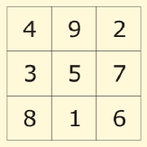

<h1 style='text-align: center;'> B. Little Elephant and Magic Square</h1>

<h5 style='text-align: center;'>time limit per test: 2 seconds</h5>
<h5 style='text-align: center;'>memory limit per test: 256 megabytes</h5>

Little Elephant loves magic squares very much.

A magic square is a 3 × 3 table, each cell contains some positive integer. At that the sums of integers in all rows, columns and diagonals of the table are equal. The figure below shows the magic square, the sum of integers in all its rows, columns and diagonals equals 15.

  The Little Elephant remembered one magic square. He started writing this square on a piece of paper, but as he wrote, he forgot all three elements of the main diagonal of the magic square. Fortunately, the Little Elephant clearly remembered that all elements of the magic square did not exceed 105. 

Help the Little Elephant, restore the original magic square, given the Elephant's notes.

## Input

The first three lines of the input contain the Little Elephant's notes. The first line contains elements of the first row of the magic square. The second line contains the elements of the second row, the third line is for the third row. The main diagonal elements that have been forgotten by the Elephant are represented by zeroes.

It is guaranteed that the notes contain exactly three zeroes and they are all located on the main diagonal. It is guaranteed that all positive numbers in the table do not exceed 105.

## Output

Print three lines, in each line print three integers — the Little Elephant's magic square. If there are multiple magic squares, you are allowed to print any of them. Note that all numbers you print must be positive and not exceed 105.

It is guaranteed that there exists at least one magic square that meets the conditions.

## Examples

## Input


```
0 1 1  
1 0 1  
1 1 0  

```
## Output


```
1 1 1  
1 1 1  
1 1 1  

```
## Input


```
0 3 6  
5 0 5  
4 7 0  

```
## Output


```
6 3 6  
5 5 5  
4 7 4  

```


#### tags 

#1100 #brute_force #implementation 