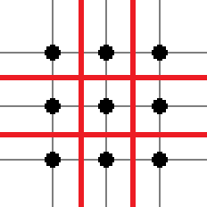
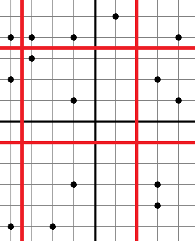

<h1 style='text-align: center;'> E. Dividing Kingdom</h1>

<h5 style='text-align: center;'>time limit per test: 2 seconds</h5>
<h5 style='text-align: center;'>memory limit per test: 256 megabytes</h5>

A country called Flatland is an infinite two-dimensional plane. Flatland has *n* cities, each of them is a point on the plane.

Flatland is ruled by king Circle IV. Circle IV has 9 sons. He wants to give each of his sons part of Flatland to rule. For that, he wants to draw four distinct straight lines, such that two of them are parallel to the *Ox* axis, and two others are parallel to the *Oy* axis. At that, no straight line can go through any city. Thus, Flatland will be divided into 9 parts, and each son will be given exactly one of these parts. Circle IV thought a little, evaluated his sons' obedience and decided that the *i*-th son should get the part of Flatland that has exactly *a**i* cities.

Help Circle find such four straight lines that if we divide Flatland into 9 parts by these lines, the resulting parts can be given to the sons so that son number *i* got the part of Flatland which contains *a**i* cities.

## Input

The first line contains integer *n* (9 ≤ *n* ≤ 105) — the number of cities in Flatland. Next *n* lines each contain two space-separated integers: *x**i*, *y**i* ( - 109 ≤ *x**i*, *y**i* ≤ 109) — the coordinates of the *i*-th city. No two cities are located at the same point. The last line contains nine space-separated integers: .

## Output

If there is no solution, print a single integer -1.

Otherwise, print in the first line two distinct real space-separated numbers: *x*1, *x*2 — the abscissas of the straight lines that are parallel to the *Oy* axis. And in the second line print two distinct real space-separated numbers: *y*1, *y*2 — the ordinates of the straight lines, parallel to the *Ox*. If there are multiple solutions, print any of them. 

When the answer is being checked, a city is considered to lie on a straight line, if the distance between the city and the line doesn't exceed 10- 6. Two straight lines are considered the same if the distance between them doesn't exceed 10- 6.

## Examples

## Input


```
9  
1 1  
1 2  
1 3  
2 1  
2 2  
2 3  
3 1  
3 2  
3 3  
1 1 1 1 1 1 1 1 1  

```
## Output


```
1.5000000000 2.5000000000  
1.5000000000 2.5000000000  

```
## Input


```
15  
4 4  
-1 -3  
1 5  
3 -4  
-4 4  
-1 1  
3 -3  
-4 -5  
-3 3  
3 2  
4 1  
-4 2  
-2 -5  
-3 4  
-1 4  
2 1 2 1 2 1 3 2 1  

```
## Output


```
-3.5000000000 2.0000000000  
3.5000000000 -1.0000000000  

```
## Input


```
10  
-2 10  
6 0  
-16 -6  
-4 13  
-4 -2  
-17 -10  
9 15  
18 16  
-5 2  
10 -5  
2 1 1 1 1 1 1 1 1  

```
## Output


```
-1  

```
## Note

The solution for the first sample test is shown below:

  The solution for the second sample test is shown below:

  There is no solution for the third sample test.


#### tags 

#2500 #binary_search #brute_force #data_structures 