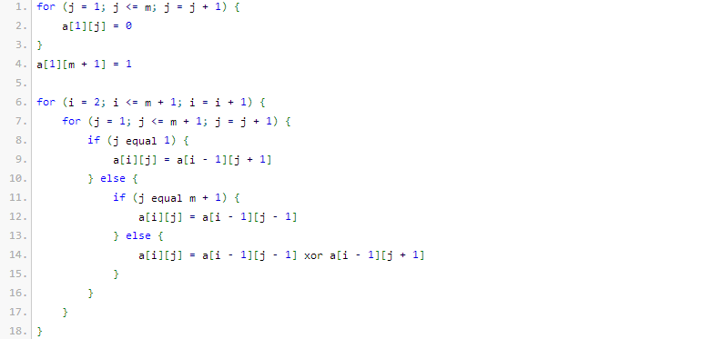

<h1 style='text-align: center;'> C. Maxim and Matrix</h1>

<h5 style='text-align: center;'>time limit per test: 2 seconds</h5>
<h5 style='text-align: center;'>memory limit per test: 256 megabytes</h5>

Maxim loves to fill in a matrix in a special manner. Here is a pseudocode of filling in a matrix of size (*m* + 1) × (*m* + 1):



Maxim asks you to count, how many numbers *m* (1 ≤ *m* ≤ *n*) are there, such that the sum of values in the cells in the row number *m* + 1 of the resulting matrix equals *t*.

Expression (*x* *xor* *y*) means applying the operation of bitwise excluding "OR" to numbers *x* and *y*. The given operation exists in all modern programming languages. For example, in languages C++ and Java it is represented by character "^", in Pascal — by "xor".

## Input

A single line contains two integers *n* and *t* (1 ≤ *n*, *t* ≤ 1012, *t* ≤ *n* + 1).

Please, do not use the %lld specifier to read or write 64-bit integers in C++. It is preferred to use the cin, cout streams or the %I64d specifier.

## Output

In a single line print a single integer — the answer to the problem. 

## Examples

## Input


```
1 1  

```
## Output


```
1  

```
## Input


```
3 2  

```
## Output


```
1  

```
## Input


```
3 3  

```
## Output


```
0  

```
## Input


```
1000000000000 1048576  

```
## Output


```
118606527258  

```


#### tags 

#2000 #constructive_algorithms #dp #math 