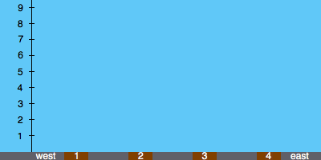

<h1 style='text-align: center;'> E. Roadside Trees</h1>

<h5 style='text-align: center;'>time limit per test: 5 seconds</h5>
<h5 style='text-align: center;'>memory limit per test: 256 megabytes</h5>

Squirrel Liss loves nuts. Liss asks you to plant some nut trees.

There are *n* positions (numbered 1 to *n* from west to east) to plant a tree along a street. Trees grow one meter per month. At the beginning of each month you should process one query. The query is one of the following types:

1. Plant a tree of height *h* at position *p*.
2. Cut down the *x*-th existent (not cut) tree from the west (where *x* is 1-indexed). When we cut the tree it drops down and takes all the available place at the position where it has stood. So no tree can be planted at this position anymore.

After processing each query, you should print the length of the longest increasing subsequence. A subset of existent trees is called an increasing subsequence if the height of the trees in the set is strictly increasing from west to east (for example, the westmost tree in the set must be the shortest in the set). The length of the increasing subsequence is the number of trees in it.

## Note

 that Liss don't like the trees with the same heights, so it is guaranteed that at any time no two trees have the exactly same heights.

## Input

The first line contains two integers: *n* and *m* (1  ≤ *n* ≤ 105; 1 ≤ *m* ≤ 2·105) — the number of positions and the number of queries.

Next *m* lines contains the information of queries by following formats:

* If the *i*-th query is type 1, the *i*-th line contains three integers: 1, *p**i*, and *h**i* (1 ≤ *p**i* ≤ *n*, 1 ≤ *h**i* ≤ 10), where *p**i* is the position of the new tree and *h**i* is the initial height of the new tree.
* If the *i*-th query is type 2, the *i*-th line contains two integers: 2 and *x**i* (1 ≤ *x**i* ≤ 10), where the *x**i* is the index of the tree we want to cut.

The input is guaranteed to be correct, i.e.,

* For type 1 queries, *p**i* will be pairwise distinct.
* For type 2 queries, *x**i* will be less than or equal to the current number of trees.
* At any time no two trees have the exactly same heights.

In each line integers are separated by single spaces.

## Output

Print *m* integers — the length of the longest increasing subsequence after each query. Separate the numbers by whitespaces.

## Examples

## Input


```
4 6  
1 1 1  
1 4 4  
1 3 4  
2 2  
1 2 8  
2 3  

```
## Output


```
1  
2  
3  
2  
2  
2  

```
## Note

States of street after each query you can see on the following animation:

  If your browser doesn't support animation png, please see the gif version here: http://212.193.37.254/codeforces/images/162/roadtree.gif


#### tags 

#3000 #data_structures #dp 