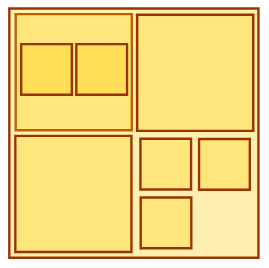

<h1 style='text-align: center;'> A. Magical Boxes</h1>

<h5 style='text-align: center;'>time limit per test: 2 seconds</h5>
<h5 style='text-align: center;'>memory limit per test: 256 megabytes</h5>

Emuskald is a well-known illusionist. One of his trademark tricks involves a set of magical boxes. The essence of the trick is in packing the boxes inside other boxes.

From the top view each magical box looks like a square with side length equal to 2*k* (*k* is an integer, *k* ≥ 0) units. A magical box *v* can be put inside a magical box *u*, if side length of *v* is strictly less than the side length of *u*. In particular, Emuskald can put 4 boxes of side length 2*k* - 1 into one box of side length 2*k*, or as in the following figure:

  Emuskald is about to go on tour performing around the world, and needs to pack his magical boxes for the trip. He has decided that the best way to pack them would be inside another magical box, but magical boxes are quite expensive to make. Help him find the smallest magical box that can fit all his boxes.

## Input

The first line of input contains an integer *n* (1 ≤ *n* ≤ 105), the number of different sizes of boxes Emuskald has. Each of following *n* lines contains two integers *k**i* and *a**i* (0 ≤ *k**i* ≤ 109, 1 ≤ *a**i* ≤ 109), which means that Emuskald has *a**i* boxes with side length 2*k**i*. It is guaranteed that all of *k**i* are distinct.

## Output

## Output

 a single integer *p*, such that the smallest magical box that can contain all of Emuskald’s boxes has side length 2*p*.

## Examples

## Input


```
2  
0 3  
1 5  

```
## Output


```
3  

```
## Input


```
1  
0 4  

```
## Output


```
1  

```
## Input


```
2  
1 10  
2 2  

```
## Output


```
3  

```
## Note

Picture explanation. If we have 3 boxes with side length 2 and 5 boxes with side length 1, then we can put all these boxes inside a box with side length 4, for example, as shown in the picture.

In the second test case, we can put all four small boxes into a box with side length 2.


#### tags 

#1600 #greedy #math 