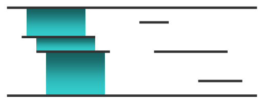

<h1 style='text-align: center;'> D. Maximum Waterfall</h1>

<h5 style='text-align: center;'>time limit per test: 2 seconds</h5>
<h5 style='text-align: center;'>memory limit per test: 256 megabytes</h5>

Emuskald was hired to design an artificial waterfall according to the latest trends in landscape architecture. A modern artificial waterfall consists of multiple horizontal panels affixed to a wide flat wall. The water flows down the top of the wall from panel to panel until it reaches the bottom of the wall.

The wall has height *t* and has *n* panels on the wall. Each panel is a horizontal segment at height *h**i* which begins at *l**i* and ends at *r**i*. The *i*-th panel connects the points (*l**i*, *h**i*) and (*r**i*, *h**i*) of the plane. The top of the wall can be considered a panel connecting the points ( - 109, *t*) and (109, *t*). Similarly, the bottom of the wall can be considered a panel connecting the points ( - 109, 0) and (109, 0). No two panels share a common point.

Emuskald knows that for the waterfall to be aesthetically pleasing, it can flow from panel *i* to panel *j* () only if the following conditions hold: 

1. *max*(*l**i*, *l**j*) < *min*(*r**i*, *r**j*) (horizontal projections of the panels overlap);
2. *h**j* < *h**i* (panel *j* is below panel *i*);
3. there is no such panel *k* (*h**j* < *h**k* < *h**i*) that the first two conditions hold for the pairs (*i*, *k*) and (*k*, *j*).

Then the flow for  is equal to *min*(*r**i*, *r**j*) - *max*(*l**i*, *l**j*), the length of their horizontal projection overlap.

Emuskald has decided that in his waterfall the water will flow in a single path from top to bottom. If water flows to a panel (except the bottom of the wall), the water will fall further to exactly one lower panel. The total amount of water flow in the waterfall is then defined as the minimum horizontal projection overlap between two consecutive panels in the path of the waterfall. Formally: 

1. the waterfall consists of a single path of panels ;
2. the flow of the waterfall is the minimum flow in the path .

 To make a truly great waterfall Emuskald must maximize this water flow, but there are too many panels and he is having a hard time planning his creation. Below is an example of a waterfall Emuskald wants:

  Help Emuskald maintain his reputation and find the value of the maximum possible water flow.

## Input

The first line of input contains two space-separated integers *n* and *t* (1 ≤ *n* ≤ 105, 2 ≤ *t* ≤ 109), the number of the panels excluding the top and the bottom panels, and the height of the wall. Each of the *n* following lines contain three space-separated integers *h**i*, *l**i* and *r**i* (0 < *h**i* < *t*,  - 109 ≤ *l**i* < *r**i* ≤ 109), the height, left and right ends of the *i*-th panel segment.

It is guaranteed that no two segments share a common point.

## Output

## Output

 a single integer — the maximum possible amount of water flow in the desired waterfall.

## Examples

## Input


```
5 6  
4 1 6  
3 2 7  
5 9 11  
3 10 15  
1 13 16  

```
## Output


```
4  

```
## Input


```
6 5  
4 2 8  
3 1 2  
2 2 3  
2 6 12  
1 0 7  
1 8 11  

```
## Output


```
2  

```
## Note

The first test case corresponds to the picture.


#### tags 

#2600 #data_structures #dp #graphs #sortings 