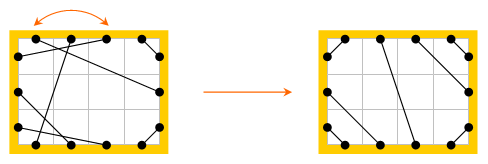

<h1 style='text-align: center;'> E. String Theory</h1>

<h5 style='text-align: center;'>time limit per test: 2 seconds</h5>
<h5 style='text-align: center;'>memory limit per test: 256 megabytes</h5>

Emuskald is an innovative musician and always tries to push the boundaries of music production. Now he has come up with an idea for a revolutionary musical instrument — a rectangular harp.

A rectangular harp is a rectangle *n* × *m* consisting of *n* rows and *m* columns. The rows are numbered 1 to *n* from top to bottom. Similarly the columns are numbered 1 to *m* from left to right. String pins are spaced evenly across every side, one per unit. Thus there are *n* pins on the left and right sides of the harp and *m* pins on its top and bottom. The harp has exactly *n* + *m* different strings, each string connecting two different pins, each on a different side of the harp.

Emuskald has ordered his apprentice to construct the first ever rectangular harp. However, he didn't mention that no two strings can cross, otherwise it would be impossible to play the harp. Two strings cross if the segments connecting their pins intersect. To fix the harp, Emuskald can perform operations of two types: 

1. pick two different columns and swap their pins on each side of the harp, not changing the pins that connect each string;
2. pick two different rows and swap their pins on each side of the harp, not changing the pins that connect each string;

In the following example, he can fix the harp by swapping two columns: 

  Help Emuskald complete his creation and find the permutations how the rows and columns of the harp need to be rearranged, or tell that it is impossible to do so. He can detach and reattach each string to its pins, so the physical layout of the strings doesn't matter.

## Input

The first line of input contains two space-separated integers numbers *n* and *m* (1 ≤ *n*, *m* ≤ 105), the height and width of the harp in units. Each of the following *n* + *m* lines contains 4 space-separated tokens, describing a single string: two symbols *a**i*, *b**i* and two integer numbers *p**i*, *q**i*. The pair *a**i*, *p**i* describes the first pin, and the pair *b**i*, *q**i* describes the second pin of the string;

A pair *s*, *x* describes the position of a single pin in a following way: 

1. *s* is equal to one of the symbols "L", "T", "R" or "B" (without quotes), which means that the pin is positioned on the left, top, right or bottom side of the harp accordingly;
2. *x* is equal to the number of the row, if the pin is on the left or right border of the harp, and to the number of the column, if the pin is on the top or bottom border of the harp.

It is guaranteed that no two different strings are connected to the same pin.

## Output

If it is possible to rearrange the rows and columns to fix the harp, on the first line output *n* space-separated integers — the old numbers of rows now placed from top to bottom in the fixed harp. On the second line, output *m* space-separated integers — the old numbers of columns now placed from left to right in the fixed harp.

If it is impossible to rearrange the rows and columns to fix the harp, output "No solution" (without quotes).

## Examples

## Input


```
3 4  
L T 1 3  
L B 2 2  
L B 3 3  
T R 1 2  
T B 2 1  
T R 4 1  
B R 4 3  

```
## Output


```
1 2 3   
3 2 1 4   

```
## Input


```
3 3  
L T 1 1  
T R 3 1  
R B 3 3  
B L 1 3  
L R 2 2  
T B 2 2  

```
## Output


```
No solution  

```


#### tags 

#3100 #geometry #math #strings 