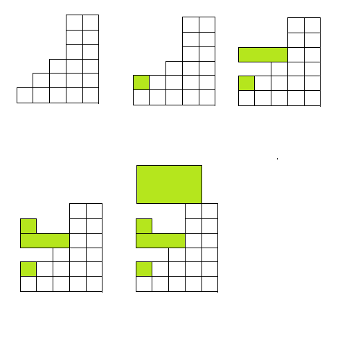

<h1 style='text-align: center;'> C. Dima and Staircase</h1>

<h5 style='text-align: center;'>time limit per test: 2 seconds</h5>
<h5 style='text-align: center;'>memory limit per test: 256 megabytes</h5>

Dima's got a staircase that consists of *n* stairs. The first stair is at height *a*1, the second one is at *a*2, the last one is at *a**n* (1 ≤ *a*1 ≤ *a*2 ≤ ... ≤ *a**n*). 

Dima decided to play with the staircase, so he is throwing rectangular boxes at the staircase from above. The *i*-th box has width *w**i* and height *h**i*. Dima throws each box vertically down on the first *w**i* stairs of the staircase, that is, the box covers stairs with numbers 1, 2, ..., *w**i*. Each thrown box flies vertically down until at least one of the two following events happen:

* the bottom of the box touches the top of a stair;
* the bottom of the box touches the top of a box, thrown earlier.

We only consider touching of the horizontal sides of stairs and boxes, at that touching with the corners isn't taken into consideration. Specifically, that implies that a box with width *w**i* cannot touch the stair number *w**i* + 1.

You are given the description of the staircase and the sequence in which Dima threw the boxes at it. For each box, determine how high the bottom of the box after landing will be. Consider a box to fall after the previous one lands.

## Input

The first line contains integer *n* (1 ≤ *n* ≤ 105) — the number of stairs in the staircase. The second line contains a non-decreasing sequence, consisting of *n* integers, *a*1, *a*2, ..., *a**n* (1 ≤ *a**i* ≤ 109; *a**i* ≤ *a**i* + 1).

The next line contains integer *m* (1 ≤ *m* ≤ 105) — the number of boxes. Each of the following *m* lines contains a pair of integers *w**i*, *h**i* (1 ≤ *w**i* ≤ *n*; 1 ≤ *h**i* ≤ 109) — the size of the *i*-th thrown box.

The numbers in the lines are separated by spaces.

## Output

Print *m* integers — for each box the height, where the bottom of the box will be after landing. Print the answers for the boxes in the order, in which the boxes are given in the input.

Please, do not use the %lld specifier to read or write 64-bit integers in C++. It is preferred to use the cin, cout streams or the %I64d specifier.

## Examples

## Input


```
5  
1 2 3 6 6  
4  
1 1  
3 1  
1 1  
4 3  

```
## Output


```
1  
3  
4  
6  

```
## Input


```
3  
1 2 3  
2  
1 1  
3 1  

```
## Output


```
1  
3  

```
## Input


```
1  
1  
5  
1 2  
1 10  
1 10  
1 10  
1 10  

```
## Output


```
1  
3  
13  
23  
33  

```
## Note

The first sample are shown on the picture.

  

#### tags 

#1500 #data_structures #implementation 