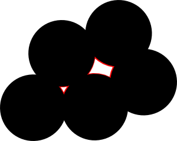

<h1 style='text-align: center;'> C. The Last Hole!</h1>

<h5 style='text-align: center;'>time limit per test: 2 seconds</h5>
<h5 style='text-align: center;'>memory limit per test: 256 megabytes</h5>

Luyi has *n* circles on the plane. The *i*-th circle is centered at (*x**i*, *y**i*). At the time zero circles start to grow simultaneously. In other words, the radius of each circle at time *t* (*t* > 0) is equal to *t*. The circles are drawn as black discs on an infinite white plane. So at each moment the plane consists of several black and white regions. Note that the circles may overlap while growing.

  We define a hole as a closed, connected white region. For instance, the figure contains two holes shown by red border. During growing some holes may be created and it is easy to see that each created hole will disappear eventually. Luyi asks you to find moment of time such that the last hole disappears. In other words, you should find the first moment such that no hole can be seen after that.

## Input

The first line of the input contains integer *n* (1 ≤ *n* ≤ 100). Each of the next *n* lines contains two integers *x**i* and *y**i* ( - 104 ≤ *x**i*, *y**i* ≤ 104), indicating the location of *i*-th circle.

It's guaranteed that no two circles are centered at the same point.

## Output

Print the moment where the last hole disappears. If there exists no moment in which we can find holes print -1.

The answer will be considered correct if the absolute or relative error does not exceed 10- 4.

## Examples

## Input


```
3  
0 0  
1 1  
2 2  

```
## Output


```
-1  

```
## Input


```
4  
0 0  
0 2  
2 2  
2 0  

```
## Output


```
1.414214  

```
## Input


```
4  
0 1  
0 -1  
-2 0  
4 0  

```
## Output


```
2.125000  

```


#### tags 

#2600 #brute_force #geometry 