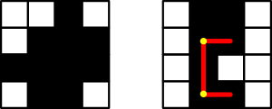

<h1 style='text-align: center;'> B. Convex Shape</h1>

<h5 style='text-align: center;'>time limit per test: 2 seconds</h5>
<h5 style='text-align: center;'>memory limit per test: 256 megabytes</h5>

Consider an *n* × *m* grid. Initially all the cells of the grid are colored white. Lenny has painted some of the cells (at least one) black. We call a painted grid convex if one can walk from any black cell to any another black cell using a path of side-adjacent black cells changing his direction at most once during the path. In the figure below, the left grid is convex while the right one is not convex, because there exist two cells which need more than one time to change direction in their path.

  You're given a painted grid in the input. Tell Lenny if the grid is convex or not.

## Input

The first line of the input contains two integers *n* and *m* (1 ≤ *n*, *m* ≤ 50) — the size of the grid. Each of the next *n* lines contains *m* characters "B" or "W". Character "B" denotes a black cell of the grid and "W" denotes a white cell of the grid.

It's guaranteed that the grid has at least one black cell.

## Output

On the only line of the output print "YES" if the grid is convex, otherwise print "NO". Do not print quotes.

## Examples

## Input


```
3 4  
WWBW  
BWWW  
WWWB  

```
## Output


```
NO  

```
## Input


```
3 1  
B  
B  
W  

```
## Output


```
YES  

```


#### tags 

#1700 #constructive_algorithms #implementation 