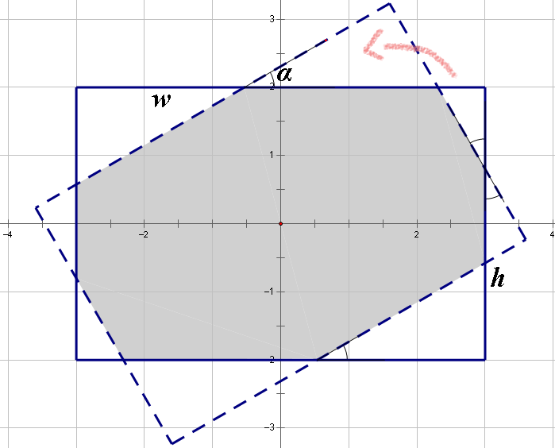

<h1 style='text-align: center;'> A. Rectangle Puzzle</h1>

<h5 style='text-align: center;'>time limit per test: 2 seconds</h5>
<h5 style='text-align: center;'>memory limit per test: 256 megabytes</h5>

You are given two rectangles on a plane. The centers of both rectangles are located in the origin of coordinates (meaning the center of the rectangle's symmetry). The first rectangle's sides are parallel to the coordinate axes: the length of the side that is parallel to the *Ox* axis, equals *w*, the length of the side that is parallel to the *Oy* axis, equals *h*. The second rectangle can be obtained by rotating the first rectangle relative to the origin of coordinates by angle α.

  Your task is to find the area of the region which belongs to both given rectangles. This region is shaded in the picture.

## Input

The first line contains three integers *w*, *h*, α (1 ≤ *w*, *h* ≤ 106; 0 ≤ α ≤ 180). Angle α is given in degrees.

## Output

In a single line print a real number — the area of the region which belongs to both given rectangles.

The answer will be considered correct if its relative or absolute error doesn't exceed 10- 6.

## Examples

## Input


```
1 1 45  

```
## Output


```
0.828427125  

```
## Input


```
6 4 30  

```
## Output


```
19.668384925  

```
## Note

The second sample has been drawn on the picture above.


#### tags 

#2000 #geometry 