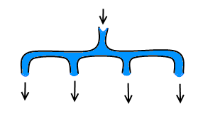

<h1 style='text-align: center;'> B. Pipeline</h1>

<h5 style='text-align: center;'>time limit per test: 0.4 seconds</h5>
<h5 style='text-align: center;'>memory limit per test: 256 megabytes</h5>

Vova, the Ultimate Thule new shaman, wants to build a pipeline. As there are exactly *n* houses in Ultimate Thule, Vova wants the city to have exactly *n* pipes, each such pipe should be connected to the water supply. A pipe can be connected to the water supply if there's water flowing out of it. Initially Vova has only one pipe with flowing water. Besides, Vova has several splitters.

A splitter is a construction that consists of one input (it can be connected to a water pipe) and *x* output pipes. When a splitter is connected to a water pipe, water flows from each output pipe. You can assume that the output pipes are ordinary pipes. For example, you can connect water supply to such pipe if there's water flowing out from it. At most one splitter can be connected to any water pipe.

  The figure shows a 4-output splitter Vova has one splitter of each kind: with 2, 3, 4, ..., *k* outputs. Help Vova use the minimum number of splitters to build the required pipeline or otherwise state that it's impossible.

Vova needs the pipeline to have exactly *n* pipes with flowing out water. Note that some of those pipes can be the output pipes of the splitters.

## Input

The first line contains two space-separated integers *n* and *k* (1 ≤ *n* ≤ 1018, 2 ≤ *k* ≤ 109).

Please, do not use the %lld specifier to read or write 64-bit integers in С++. It is preferred to use the cin, cout streams or the %I64d specifier.

## Output

Print a single integer — the minimum number of splitters needed to build the pipeline. If it is impossible to build a pipeline with the given splitters, print -1.

## Examples

## Input


```
4 3  

```
## Output


```
2  

```
## Input


```
5 5  

```
## Output


```
1  

```
## Input


```
8 4  

```
## Output


```
-1  

```


#### tags 

#1700 #binary_search #math 